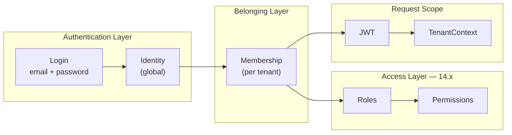

# ADR-006 — Identity Strategy

# Status

```text
ACCEPTED
```

---

# Date

```text
2026-05-27
```

---

# Decision Makers

* Platform Architecture Team
* CodeCore Core Engineering

---

# Related Documents

* [PASO-13.0.1-IDENTITY-STRATEGY-DECISION.md](../audits/PASO-13.0.1-IDENTITY-STRATEGY-DECISION.md)
* [PASO-13.0-TENANT-AWARE-OPERATIONS-AUDIT.md](../audits/PASO-13.0-TENANT-AWARE-OPERATIONS-AUDIT.md)
* ADR-003 — Multi-Tenant Isolation Strategy
* ADR-005 — Domain-Driven Design Strategy

---

# Context

CodeCore is an enterprise SaaS platform built as a modular monolith with:

* Spring Boot 3, Java 21, WebFlux, R2DBC, PostgreSQL
* DDD and Hexagonal Architecture
* Strict multi-tenant isolation (ADR-003)

## Current state (PASO 12.x – 13.0)

IAM implements a **hybrid identity model**:

| Mechanism | Role |
|-----------|------|
| `iam.iam_user.tenant_id` | Identity lookup, uniqueness, persistence |
| `iam.identity_tenant_membership` | Formal N:M membership; gate on login/register |
| JWT `tenantId` claim → `TenantContext` | Active tenant on authenticated requests |

Login and registration still depend on `findByTenantAndEmail` / `existsByTenantAndEmail`, scoped by `iam_user.tenant_id`.

The system currently allows the **same email in different tenants as different `identity_id` values** — two `iam_user` rows — even though the membership table was designed for global identity:

```sql
-- V7 comment (authoritative design intent)
'N:M link between global Identity and Tenant (formal membership; no roles).'
```

This creates:

* Dual source of truth (identity tenant vs. membership tenant can diverge)
* Blocked SaaS capabilities: single login, invitations, tenant switching, seat-based billing
* RBAC ambiguity in upcoming Authorization Foundation (14.x)
* ~120 code references to `tenant_id` before legacy column can be removed

A formal decision is required before continuing Authorization Foundation (13.x) and RBAC (14.x).

---

# Decision

CodeCore adopts:

```text
Identity Global + Membership
```

as the **definitive identity model**.

## Canonical model

```text
Identity (global)
  ├── email (globally unique)
  ├── credentials
  ├── authentication status
  └── 1..N Memberships
        ├── tenantId
        ├── membership status (ACTIVE / INACTIVE)
        └── roles & permissions (14.x — scoped to membership)
```

### Rules

1. **One `Identity` per normalized email** across the platform.
2. **Tenant belonging** is expressed exclusively through `IdentityTenantMembership` (after migration completes).
3. **`Identity` does not carry `TenantId`** — it is not a tenant-scoped aggregate.
4. **JWT subject** = `identityId`; **JWT active tenant** = validated ACTIVE membership tenant.
5. **`TenantContext`** remains the runtime source for the active tenant on authenticated requests.
6. **RBAC** assigns roles to **Membership**, not to bare Identity.
7. **Tenant isolation** (ADR-003) is enforced via membership validation + `TenantContext` + tenant-scoped authorization — not via duplicated identities per tenant.

---

# Alternatives Considered

## Option A — Identity Tenant Scoped (status quo)

```text
Tenant A: user@company.com → Identity #1
Tenant B: user@company.com → Identity #2
```

| Pros | Cons |
|------|------|
| Zero immediate migration | Perpetuates dual source of truth |
| Simple current login (`X-Tenant-Id` + tenant-scoped lookup) | Contradicts V7 design intent |
| Accidental isolation via credential duplication | Multiple passwords possible for same person |
| | Blocks invitations, tenant switching, single login |
| | RBAC must duplicate across identities |
| | Growing migration cost in 14.x+ |

**Rejected** as definitive model. May persist temporarily as legacy column during transition 13.1–13.4.

---

## Option B — Identity Global + Membership (chosen)

```text
Identity: user@company.com
  ├── Membership A (ADMIN)
  ├── Membership B (VETERINARIAN)
  └── Membership C (READ_ONLY)
```

| Pros | Cons |
|------|------|
| Aligns with V7, Context Map, SaaS roadmap | Significant IAM refactor |
| Single login, password reset, account state | Data consolidation required for duplicate identities |
| Natural invitations and tenant switching | Multi-membership login UX needed |
| RBAC on membership (14.x) | Careful security ordering in auth refactor |
| Capitalizes on PASO 12.1–12.3 investment | Temporary coexistence with legacy column |

**Accepted** as definitive model.

---

# Consequences

## Positive

* Clear aggregate boundaries: `Identity` (authentication) vs. `IdentityTenantMembership` (belonging) vs. Authorization (roles/permissions in 14.x).
* Eliminates long-term dual source of truth.
* Enables enterprise SaaS workflows: organizations, invitations, billing per seat, marketplace users.
* `TenantContext` (12.9) and JWT tenant claim (12.8) remain valid — they represent **active operational tenant**, not identity scope.
* Membership table and transactional registration (12.7) become the structural foundation rather than parallel legacy.

## Negative

* IAM module requires phased refactor (13.1–13.5).
* Existing data with duplicate emails across tenants must be consolidated (13.3).
* Login API evolves: `X-Tenant-Id` may become optional when user has single membership; required or replaced by tenant picker when multiple.
* Domain model change: `Identity` must leave tenant-scoped `AggregateRoot` pattern.
* Specifications (`repositories.md`, `security-rules.md`, workflows) require updates.

## Risks and mitigations

| Risk | Mitigation |
|------|------------|
| Cross-tenant auth bypass | Mandatory ACTIVE membership check; isolation integration tests |
| Data loss during identity merge | Dry-run scripts; staging validation; backup before 13.3 |
| User enumeration | Uniform 401 until password validated; do not expose membership list pre-auth |
| Legacy JWT without `tenantId` | Token rotation window (per 12.8 transition plan) |
| Performance of email lookup + membership join | Index on `normalized_email`; query plan validation in 13.1 |

## Technical debt to retire

* `iam_user.tenant_id` column and `UNIQUE (tenant_id, normalized_email)`
* `Identity extends AggregateRoot(TenantId)`
* Tenant-scoped `IdentityRepository` API
* Test `shouldAllowSameEmailInDifferentTenants` semantics (invert to one identity, two memberships)
* Hybrid source-of-truth documented in PASO 12.4 / 13.0

---

# Mandatory Design Answers

| Question | Answer |
|----------|--------|
| Should `Identity` inherit `TenantId` from `AggregateRoot`? | **No** |
| Should `TenantId` leave the `Identity` aggregate? | **Yes** |
| Should `Membership` be the sole source of tenant belonging? | **Yes** (after 13.5) |
| Should JWT represent Identity or Membership? | **Identity as subject**; **membership tenant as operational context** |
| Is `TenantContext` still valid? | **Yes** |
| Does RBAC fit better with global or tenant-scoped identity? | **Global identity + membership-scoped roles** |

---

# Future Impact

| Area | Impact of Option B |
|------|-------------------|
| Authorization Foundation (13.x) | Membership as authorization prerequisite |
| Roles (14.x) | Assigned to `MembershipId` |
| Permissions (14.x) | Evaluated in `(identityId, tenantId, membership)` context |
| RBAC (14.x) | `Identity → Membership → Role → Permission` |
| Invitations | Invite email → create membership on existing or new identity |
| Organizations | Membership links person to organization/tenant |
| Billing per tenant | Count ACTIVE memberships as seats |
| Tenant switching | Re-issue JWT with different validated membership tenant |

---

# Transition Strategy

**Pattern:** Strangler fig — introduce global lookup and membership-first auth **before** dropping legacy column.

```text
13.0   Audit (complete) — hybrid model documented
13.0.1 Decision (this ADR) — Option B accepted
13.1   Identity Lookup Migration — findByEmail; deprecate tenant-scoped lookup in code
13.2   Authentication Refactor — membership-first; JWT from validated membership
13.3   Identity Consolidation — merge duplicate identity_id per email
13.4   Source of Truth Verification — zero drift queries
13.5   Deprecate iam_user.tenant_id — schema + domain cleanup
14.x   Roles, permissions, RBAC on membership
```

During 13.1–13.4, `iam_user.tenant_id` may remain populated (synced from membership) for rollback safety. Column removal occurs only in **13.5** after verification passes.

### 13.1 — Identity Lookup Migration

* Add `findByEmail(EmailAddress)` to `IdentityRepository`
* Replace `findByTenantAndEmail` / `existsByTenantAndEmail` in login and register
* Update specifications

### 13.2 — Authentication Refactor

* Reorder auth flow: email → identity → password → ACTIVE membership
* Emit JWT `tenantId` from validated membership
* Preserve 401/403 semantics and anti-enumeration

### 13.3 — Identity Consolidation Strategy

* Inventory emails with multiple `identity_id`
* Define canonical identity selection rules
* Reassign memberships; deprecate duplicate identities
* Document runbook and rollback

### 13.4 — Tenant Source of Truth Verification

* Reconciliation queries (identity without membership, orphan membership, tenant mismatch)
* Optional FK constraints after data clean
* CI or operational drift checks

### 13.5 — Deprecate `iam_user.tenant_id`

* Flyway: drop column, replace uniqueness with global `normalized_email`
* Refactor `Identity` domain model and persistence
* Remove tenant parameter from identity repository lookups
* Full IAM test suite green

---

# Compliance with ADR-003 (Multi-Tenant Isolation)

Option B does **not** weaken tenant isolation.

Isolation is preserved by:

```text
Every authenticated operation
  → JWT carries active tenantId
  → TenantContext propagates tenant
  → Authorization validates membership + roles
  → Persistence queries remain tenant-scoped
```

Global identity affects **who can authenticate**, not **what tenant data they can access**. Access still requires ACTIVE membership in the target tenant.

---

# Target Architecture Diagram



---

# Acceptance Criteria

| Criterion | Status |
|-----------|--------|
| Formal architectural decision recorded | ✅ Option B |
| Alternatives documented | ✅ A and B |
| Consequences and risks documented | ✅ |
| Transition roadmap defined | ✅ 13.1–13.5 |
| Mandatory questions answered | ✅ |
| No code changes in this ADR | ✅ |

---

# Revision History

| Version | Date | Change |
|---------|------|--------|
| 1.0 | 2026-05-27 | Initial acceptance — Identity Global + Membership |
