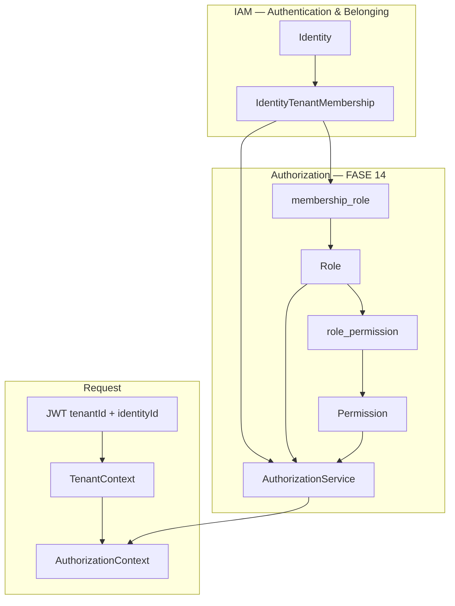

# ADR-007 — Authorization Model

# Status

```text
ACCEPTED
```

---

# Date

```text
2026-05-27
```

---

# Decision Makers

* Platform Architecture Team
* CodeCore Core Engineering

---

# Related Documents

* [PASO-14.0-AUTHORIZATION-FOUNDATION.md](../audits/PASO-14.0-AUTHORIZATION-FOUNDATION.md)
* [ADR-006-IDENTITY-STRATEGY.md](ADR-006-IDENTITY-STRATEGY.md)
* ADR-003 — Multi-Tenant Isolation Strategy
* ADR-005 — Domain-Driven Design Strategy
* `codecore-specifications/module-blueprints/authorization-management/`

---

# Context

CodeCore completed FASE 13 (Identity Global + Membership). Authentication is operational:

* Global `Identity` lookup by email
* `IdentityTenantMembership` as belonging gate
* JWT with `identityId` + `tenantId` → `TenantContext`

Authorization (roles, permissions, access decisions) was intentionally deferred until identity and membership foundations were stable.

ADR-006 mandates:

```text
Identity → Membership → Role → Permission → Authorization
```

Authorization must **never** be evaluated directly on bare `Identity`.

---

# Decision

CodeCore adopts a **membership-scoped RBAC model** with **global permissions** and **tenant-scoped roles**.

## Canonical authorization chain

```text
Identity (global, authentication only)
  └── IdentityTenantMembership (belonging + ACTIVE gate)
        └── RoleAssignment (membership_role — N:M)
              └── Role (tenant-scoped aggregate)
                    └── Permission (global catalog, N:M via role_permission)
                          └── Authorization evaluation
```

## Model rules

| Element | Scope | Owner aggregate | Uniqueness |
|---------|-------|-----------------|------------|
| `Permission` | Global platform | `Permission` | `code` globally unique |
| `Role` | Tenant | `Role` | `code` unique per `tenant_id` |
| `RolePermission` | Association | `Role` (consistency boundary) | N:M, no duplicates |
| `MembershipRole` | Association | `Membership` + `Role` | N:M; role.tenant must match membership.tenant |

### Permission code convention (FASE 14)

```text
resource:action
```

Examples: `user:create`, `patient:view`, `appointment:update`.

Lowercase, colon-separated, atomic actions. Differs from legacy blueprint `CREATE_PATIENT` style — ROADMAP FASE 14 is authoritative for implementation.

### Role code convention (FASE 14)

```text
UPPER_SNAKE_CASE
```

Examples: `ADMIN`, `MANAGER`, `VET`, `RECEPTIONIST`, `READ_ONLY`.

---

# Aggregates and boundaries (FASE 14 scope)

## In scope (14.0–14.9)

| Aggregate / concept | Responsibility | Transaction boundary |
|---------------------|----------------|----------------------|
| **Role** | Tenant-scoped role lifecycle; owns permission assignments (14.3) | Strong consistency |
| **Permission** | Global permission catalog | Strong consistency; mostly immutable after seed |
| **IdentityTenantMembership** (IAM) | Belonging; receives role assignments (14.4) | IAM aggregate; auth module references `MembershipId` |
| **AuthorizationService** (application) | `hasPermission`, `hasAnyPermission`, `hasRole` | Read-mostly; no aggregate root |

## Explicitly out of scope (FASE 14)

Deferred to future phases unless explicitly requested:

* `PolicyAggregate` / ABAC rules
* `PrivilegeAggregate`
* `AuthorizationDecisionAggregate` (persistent audit decisions)
* External policy engines (OPA, etc.)
* CQRS read models / permission snapshots in JWT as authoritative source
* Role hierarchy / inheritance

Specifications in `authorization-management/aggregates.md` describe a **target catalog**; FASE 14 implements the **RBAC spine** only.

---

# Physical placement

## Logical bounded context

**Authorization Management** — downstream of IAM (Context Map: Customer/Supplier).

IAM owns authentication; Authorization owns RBAC evaluation.

## Physical module (FASE 14)

Authorization is implemented **inside** `modules/identity-access-management`:

```text
com.codecore.iam.domain.model.role.*
com.codecore.iam.domain.model.permission.*   (14.2)
com.codecore.iam.application.port.out.RoleRepository
com.codecore.iam.infrastructure.persistence.* (role tables)
```

**Rationale:**

* Only IAM has an active Gradle module and Flyway pipeline today.
* `Tenant`, `IdentityTenantMembership` already live in IAM — role assignment requires tight coupling to membership IDs.
* Gradle projects `authorization-management:*` remain declared in `settings.gradle.kts` as **placeholders** for future extraction (FASE 15+), consistent with `tenant-management` and `user-management`.

## Database schema

Extend existing **`iam`** schema (same Flyway location: `apps/codecore-api/src/main/resources/db/migration/`):

| Table | Step | Notes |
|-------|------|-------|
| `iam.role` | 14.1 | Tenant-scoped |
| `iam.permission` | 14.2 | Global catalog |
| `iam.role_permission` | 14.3 | N:M |
| `iam.membership_role` | 14.4 | FK to `iam.identity_tenant_membership.membership_id` |

Cross-tenant assignment is forbidden at domain and persistence layers.

---

# Authorization evaluation

## Runtime context

```text
JWT (identityId, tenantId)
  → TenantContext
  → resolve ACTIVE Membership(identityId, tenantId)
  → load roles for membershipId
  → expand permissions via role_permission
  → evaluate requested permission / role
```

## Principles

| Principle | Rule |
|-----------|------|
| Deny by default | Missing membership, role, or permission → **403** |
| No identity-level grants | Never query roles by `identityId` without tenant/membership scope |
| Tenant isolation | Role.tenantId must equal membership.tenantId and JWT tenantId |
| JWT hints non-authoritative | Optional future JWT role claims are hints only; runtime check required for sensitive operations |
| Membership ACTIVE required | INACTIVE membership → no authorization (403) |

## Application API (14.5)

```text
hasPermission(membershipContext, permissionCode) → boolean
hasAnyPermission(membershipContext, permissionCodes...) → boolean
hasRole(membershipContext, roleCode) → boolean
```

`AuthorizationContext` (14.6) bundles `identityId`, `tenantId`, `membershipId`, and resolved grants for use cases and HTTP filters (14.7).

---

# Relationship to ADR-006

| ADR-006 rule | Authorization implication |
|--------------|---------------------------|
| RBAC on membership | `membership_role` links roles to `MembershipId`, not `IdentityId` |
| Global identity | Same person, different tenants → different role sets per membership |
| TenantContext | Authorization always scoped to JWT active tenant |
| `iam_user.tenant_id` legacy | Irrelevant to authorization path; membership is the anchor |

---

# Alternatives considered

## A — Identity-scoped roles

Assign roles directly to `IdentityId`.

**Rejected.** Violates ADR-006; breaks tenant isolation when one identity has multiple memberships.

## B — Tenant-scoped permissions

Each tenant defines its own permission catalog.

**Rejected for FASE 14.** Complicates platform consistency; global catalog with tenant-scoped roles is sufficient for SaaS MVP.

## C — Separate `auth` PostgreSQL schema

Physical schema split from `iam`.

**Deferred.** Same database, `iam` schema extension is sufficient for dev monolith; schema split optional during module extraction.

## D — External authorization framework (Spring Authorization Server, OPA, Casbin)

**Rejected** per project constraints unless explicitly requested.

---

# Consequences

## Positive

* Clear chain aligned with ADR-006 and ROADMAP FASE 14.
* Tenant isolation enforced at membership + role boundaries.
* Incremental delivery: 14.1 → 14.9 without blocking on policy engine.
* Reuses IAM infrastructure (R2DBC, Flyway, tests).

## Negative

* Authorization code temporarily co-located with IAM — extraction effort in FASE 15+.
* Permission naming diverges from uppercase blueprint examples — specifications need sync in a later doc pass.

## Risks and mitigations

| Risk | Mitigation |
|------|------------|
| Cross-tenant role assignment | Domain validation + FK + integration tests (14.9) |
| Privilege escalation via custom roles | System roles immutable; seed ADMIN with bounded catalog (14.8) |
| Performance (N+1 role/permission loads) | Repository join queries; caching deferred post-14.9 |
| Confusion IAM vs Authorization | Package separation + this ADR; HTTP auth filter in dedicated security package |

---

# Compliance

## ADR-003 (Multi-Tenant Isolation)

Authorization strengthens isolation:

```text
Every protected operation
  → Valid JWT tenantId
  → ACTIVE membership in that tenant
  → Roles belonging to same tenant
  → Permissions expanded only from those roles
```

## ADR-005 (DDD)

* `Role` and `Permission` are aggregate roots with explicit invariants.
* `membership_role` is an association managed through application services with domain rules.
* Authorization evaluation is an application/domain service, not an aggregate.

---

# Target diagram



---

# FASE 14 delivery map

| Step | Deliverable |
|------|-------------|
| 14.0 | This ADR + foundation audit |
| 14.1 | `Role` aggregate, `iam.role` |
| 14.2 | `Permission` aggregate, `iam.permission` |
| 14.3 | `role_permission` |
| 14.4 | `membership_role` |
| 14.5 | AuthorizationService |
| 14.6 | AuthorizationContext + use case integration |
| 14.7 | HTTP authorization (WebFlux) |
| 14.8 | Seeds (ADMIN, OWNER, READ_ONLY + catalog) |
| 14.9 | Verification suite |

---

# Acceptance criteria

| Criterion | Status |
|-----------|--------|
| Authorization model defined | ✅ |
| Membership-scoped RBAC mandated | ✅ |
| Aggregates and boundaries documented | ✅ |
| Physical placement decided | ✅ IAM co-location FASE 14 |
| Out-of-scope items explicit | ✅ |
| No implementation in this ADR | ✅ |

---

# Revision History

| Version | Date | Change |
|---------|------|--------|
| 1.0 | 2026-05-27 | Initial acceptance — Membership-scoped RBAC |
