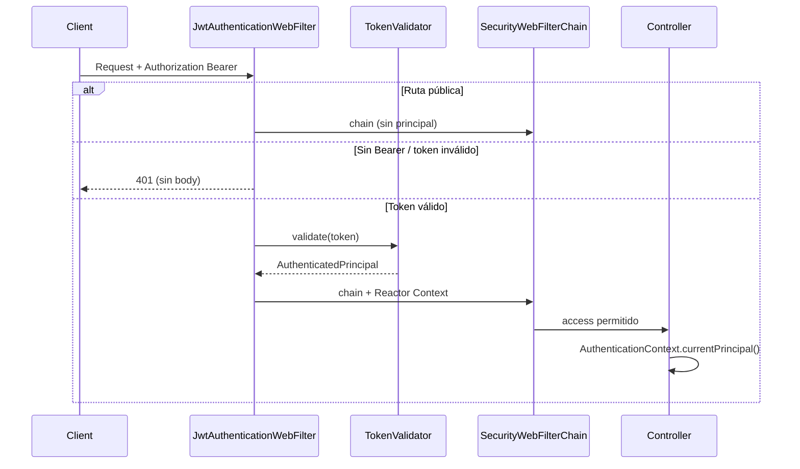

# PASO 11.3 — Authentication WebFilter (auditoría previa)

**Fecha:** 2026-06-01

---

## 1. Componentes revisados (11.2)

| Componente | Ubicación | Rol |
|------------|-----------|-----|
| `TokenValidator` | `application.port.out` | Puerto outbound |
| `JwtTokenValidator` | `infrastructure.security` | `@Component`, HS256 + issuer + claims |
| `AuthenticatedPrincipal` | `application.dto` | `identityId`, `email`, `status` |
| `InvalidTokenException` / `ExpiredTokenException` | `domain.exception` | Sin detalle HTTP |
| `PlatformSecurityAutoConfiguration` | `platform-security` | `SecurityWebFilterChain`, `permitAll` + `authenticated()` |

**Estado antes de 11.3:** `authenticated()` sin filtro JWT → rutas protegidas rechazan anónimo, pero **no hay validación de token ni principal en el request**.

---

## 2. Endpoints `permitAll` actuales

| Método | Ruta | Motivo |
|--------|------|--------|
| `POST` | `/api/v1/identities` | Registro |
| `POST` | `/api/v1/auth/login` | Login |
| `GET` | `/actuator/health` | Health check |

**Todo lo demás:** requiere JWT válido (tras 11.3).

---

## 3. Ubicación propuesta

| Artefacto | Módulo | Paquete |
|-----------|--------|---------|
| `JwtAuthenticationWebFilter` | IAM | `interfaces.http.security` |
| `AuthenticationContext` | IAM | `interfaces.http.security` |
| `PublicApiPaths` | IAM | `interfaces.http.security` |
| `AuthenticatedPrincipalAuthorizationManager` | IAM | `interfaces.http.security` |
| `GET /api/v1/auth/me` | IAM | `AuthenticationController` + `dto.MeResponse` |
| Integración cadena | `platform-security` | `PlatformSecurityAutoConfiguration` — `addFilterAt` + `access(manager)` si bean `jwtAuthenticationWebFilter` presente |

**Rationale:** el filtro depende de `TokenValidator` (puerto IAM). `platform-security` no depende de IAM; enlaza por nombre de bean (`jwtAuthenticationWebFilter`) y `ObjectProvider<ReactiveAuthorizationManager>`.

---

## 4. Flujo HTTP propuesto

---

## 5. Riesgos (documentar en PASO-11.3)

1. JWT sin `tenantId` — contexto no aísla tenant.
2. JWT sin roles — sin autorización.
3. Authorization / RBAC no implementada.
4. Refresh token fuera de alcance.

---

## 6. Verificación hexagonal

| Capa | Spring Security |
|------|-----------------|
| Domain | No |
| Application | No (solo `AuthenticatedPrincipal`, `TokenValidator`) |
| Infrastructure | JJWT solo en `JwtTokenValidator` |
| Interfaces HTTP | Filtro + contexto Reactor (sin `AuthenticationManager` / `UserDetailsService`) |
