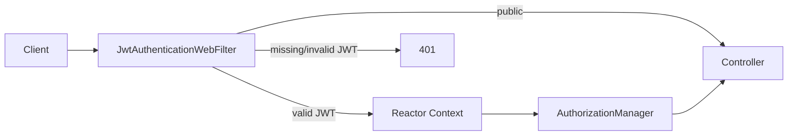

# PASO 11.3 — Authentication WebFilter

**Fecha:** 2026-06-01

---

## 1. Objetivo

Integrar validación JWT en el pipeline HTTP reactivo (WebFlux) y exponer `AuthenticatedPrincipal` durante el request. Sin autorización, roles ni permissions.

---

## 2. Arquitectura

| Artefacto | Capa | Módulo |
|-----------|------|--------|
| `TokenValidator` | Application port out | IAM |
| `JwtTokenValidator` | Infrastructure | IAM |
| `AuthenticatedPrincipal` | Application DTO | IAM |
| `JwtAuthenticationWebFilter` | Interfaces HTTP | IAM |
| `AuthenticationContext` | Interfaces HTTP | IAM |
| `AuthenticatedPrincipalAuthorizationManager` | Interfaces HTTP | IAM |
| `PlatformSecurityAutoConfiguration` | Platform | platform-security |

**Hexagonal:** dominio y application sin Spring Security. JJWT solo en `JwtTokenValidator`. El filtro invoca el puerto `TokenValidator`.

---

## 3. Flujo HTTP

1. Request entra en `JwtAuthenticationWebFilter` (`SecurityWebFiltersOrder.AUTHENTICATION`).
2. Si ruta pública (`PublicApiPaths`) → continúa sin JWT.
3. Si ruta protegida:
   - Sin `Authorization: Bearer <token>` → **401** (sin body).
   - Token inválido / expirado / firma incorrecta → **401** (sin mensaje interno).
   - Token válido → `TokenValidator.validate` → principal en **Reactor Context** (`AuthenticationContext`).
4. `AuthenticatedPrincipalAuthorizationManager` permite el exchange solo si hay principal en contexto.
5. Controllers usan `AuthenticationContext.currentPrincipal()` (p. ej. `GET /api/v1/auth/me`).



---

## 4. Endpoints

### Públicos (`permitAll` + filtro no exige JWT)

| Método | Ruta |
|--------|------|
| `POST` | `/api/v1/identities` |
| `POST` | `/api/v1/auth/login` |
| `GET` | `/actuator/health` |

### Protegidos (JWT válido)

| Método | Ruta | Notas |
|--------|------|-------|
| `GET` | `/api/v1/auth/me` | Devuelve `identityId`, `email`, `status` desde contexto |

Cualquier otra ruta bajo la cadena de seguridad requiere JWT válido.

---

## 5. Respuesta `GET /api/v1/auth/me`

```json
{
  "identityId": "uuid",
  "email": "user@example.com",
  "status": "ACTIVE"
}
```

---

## 6. Tests

| Test | Alcance |
|------|---------|
| `JwtAuthenticationWebFilterTest` | Público, 401 sin Bearer, inválido/expirado, contexto con principal |
| `AuthenticationMeControllerIT` | `/me` con JWT, 401 sin/inválido/expirado, login público |

---

## 7. Riesgos identificados

1. **JWT sin `tenantId`** — el contexto no aísla tenant; el login sigue usando `X-Tenant-Id`.
2. **JWT sin roles** — no hay autorización basada en claims.
3. **Authorization no implementada** — solo autenticación (presencia de principal).
4. **Refresh token fuera de alcance** — solo access token.

---

## 8. Verificación

- Dominio / application sin dependencias Spring Security.
- JWT encapsulado en infrastructure (`JwtTokenValidator` / `JwtTokenProvider`).
- `SecurityWebFilterChain` en `platform-security` enlaza filtro IAM por bean `jwtAuthenticationWebFilter`.
- `./gradlew build` → **BUILD SUCCESSFUL**.
