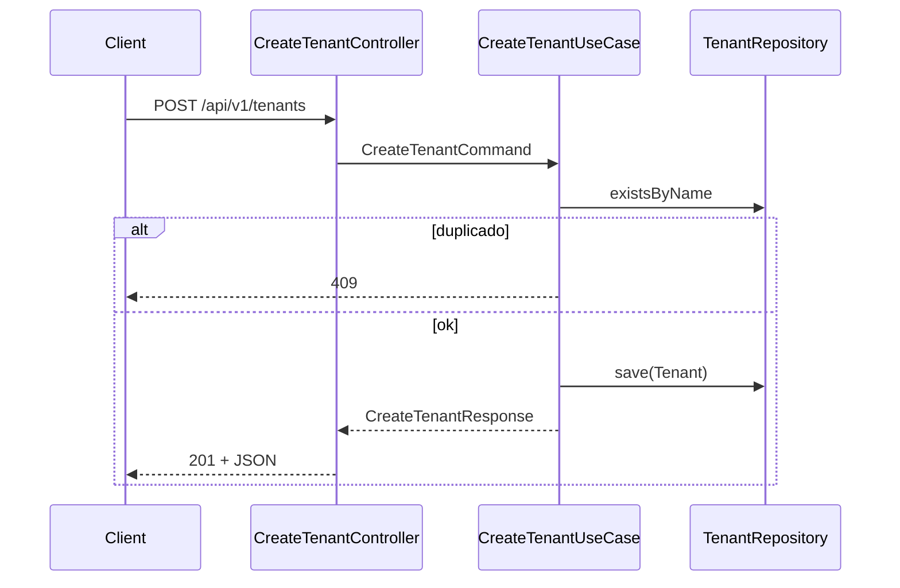

# PASO 12.1 — Create Tenant

**Fecha:** 2026-06-01

---

## 1. Objetivo

Primer caso de uso del ciclo de vida de **Tenant**: `CreateTenantUseCase` + endpoint HTTP mínimo `POST /api/v1/tenants`.

---

## 2. Decisiones arquitectónicas

| Decisión | Motivo |
|----------|--------|
| Mismo patrón que `RegisterIdentityUseCase` | Consistencia hexagonal en IAM |
| `existsByName` + `UNIQUE (name)` (V6) | Unicidad en aplicación y BD |
| `POST /api/v1/tenants` en `permitAll` | Bootstrap de tenants sin JWT |
| `CreateTenantHttpResponse` en HTTP | Evita colisión con `application.dto.CreateTenantResponse` |
| Sin use case de membresía / Identity | Fuera de alcance 12.1 |

---

## 3. Flujo

1. `CreateTenantController` recibe `{ "name": "..." }`.
2. `CreateTenantUseCaseImpl` valida nombre → `TenantName.of`.
3. `TenantRepository.existsByName` — si existe → `TenantAlreadyExistsException` (409).
4. `Tenant.create` + `save` → `CreateTenantResponse`.
5. Controller mapea a JSON: `tenantId`, `name`, `status`.



---

## 4. DTOs

| Tipo | Clase | Campos |
|------|-------|--------|
| Command | `CreateTenantCommand` | `name` |
| Application response | `CreateTenantResponse` | `tenantId`, `name`, `status` (VOs) |
| HTTP request | `CreateTenantRequest` | `name` (@NotBlank) |
| HTTP response | `CreateTenantHttpResponse` | `tenantId` (UUID), `name`, `status` |

---

## 5. Endpoint

**`POST /api/v1/tenants`** — público (sin JWT)

Request:

```json
{ "name": "PetNova Demo" }
```

Response `201 Created`:

```json
{
  "tenantId": "uuid",
  "name": "PetNova Demo",
  "status": "ACTIVE"
}
```

Errores: **400** validación / dominio inválido, **409** nombre duplicado (sin cuerpo, sin stacktrace).

---

## 6. Persistencia

- Puerto: `existsByName(TenantName)`
- Flyway **V6**: `uq_tenant_name UNIQUE (name)`

---

## 7. Tests

| Test | Alcance |
|------|---------|
| `CreateTenantUseCaseTest` | Éxito, duplicado, nombre inválido |
| `CreateTenantControllerIT` | 201 + fila, 409, 400 (Testcontainers) |

---

## 8. Riesgos

1. Tenant sin miembros.
2. Sin relación formal con `Identity` / FK.
3. JWT sin `tenantId`.
4. Tenant Context no implementado.

---

## 9. Verificación

`./gradlew build` → **BUILD SUCCESSFUL**
