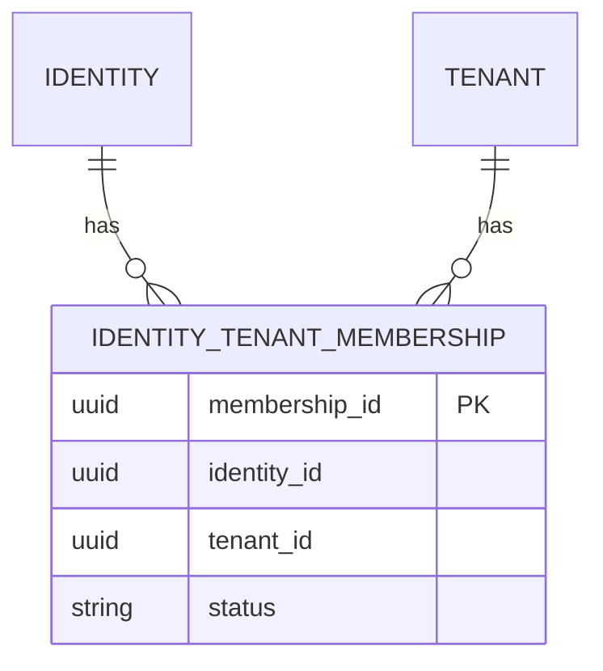

# PASO 12.2 — Identity Tenant Membership

**Fecha:** 2026-06-01

---

## 1. Objetivo

Relación formal **N:M** entre `Identity` y `Tenant` mediante el aggregate `IdentityTenantMembership`, sin roles ni validación en login.

---

## 2. Decisiones arquitectónicas

| Decisión | Motivo |
|----------|--------|
| Modelo **N:M** | Una identity puede pertenecer a varios tenants |
| Tabla puente `identity_tenant_membership` | Fuente formal de membership |
| Mantener `iam_user.tenant_id` | Compatibilidad con registro/login actuales; convergencia en pasos futuros |
| Sin FK en Flyway | Consistente con V1–V6 (integridad vía app + `UNIQUE`) |
| `MembershipStatus` distinto de `IdentityStatus` / `TenantStatus` | Solo vigencia del vínculo, no del usuario ni del tenant |

---

## 3. Modelo de dominio

### Aggregate: `IdentityTenantMembership`

| Campo | Tipo |
|-------|------|
| `id` | `MembershipId` |
| `identityId` | `IdentityId` |
| `tenantId` | `TenantId` |
| `status` | `MembershipStatus` (`ACTIVE`, `INACTIVE`) |
| `createdAt` / `updatedAt` | `Instant` |

Factory: `create(identityId, tenantId, now)` → `ACTIVE`.

### Puerto: `MembershipRepository`

- `save`
- `exists(identityId, tenantId)`
- `findByIdentityId` → `Flux`
- `findByTenantId` → `Flux`

---

## 4. Persistencia

| Artefacto | Rol |
|-----------|-----|
| `V7__create_identity_tenant_membership_table.sql` | Tabla + `UNIQUE(identity_id, tenant_id)` |
| `IamIdentityTenantMembershipEntity` | R2DBC |
| `IamIdentityTenantMembershipMapper` | Dominio ↔ fila |
| `R2dbcMembershipRepository` | Adapter |

---

## 5. Diagrama N:M

*(Lógico; sin FK física en esta fase.)*

---

## 6. Tests

| Test | Alcance |
|------|---------|
| `IdentityTenantMembershipTest` | Creación, activate/deactivate |
| `R2dbcMembershipRepositoryIT` | save, exists, find por identity/tenant, update status |

---

## 7. Riesgos

1. Membership **no** validada en login.
2. JWT sin claim `tenantId`.
3. Tenant Context no implementado.
4. Doble modelo (`iam_user.tenant_id` + membership) hasta refactor.

---

## 8. Pasos futuros habilitados

- Validar membership en `AuthenticateIdentity` / registro.
- Crear membership automática al registrar identity.
- Claim `tenantId` en JWT + Tenant Context.
- Roles/permissions sobre membership.

---

## 9. Verificación

`./gradlew build` → **BUILD SUCCESSFUL**
