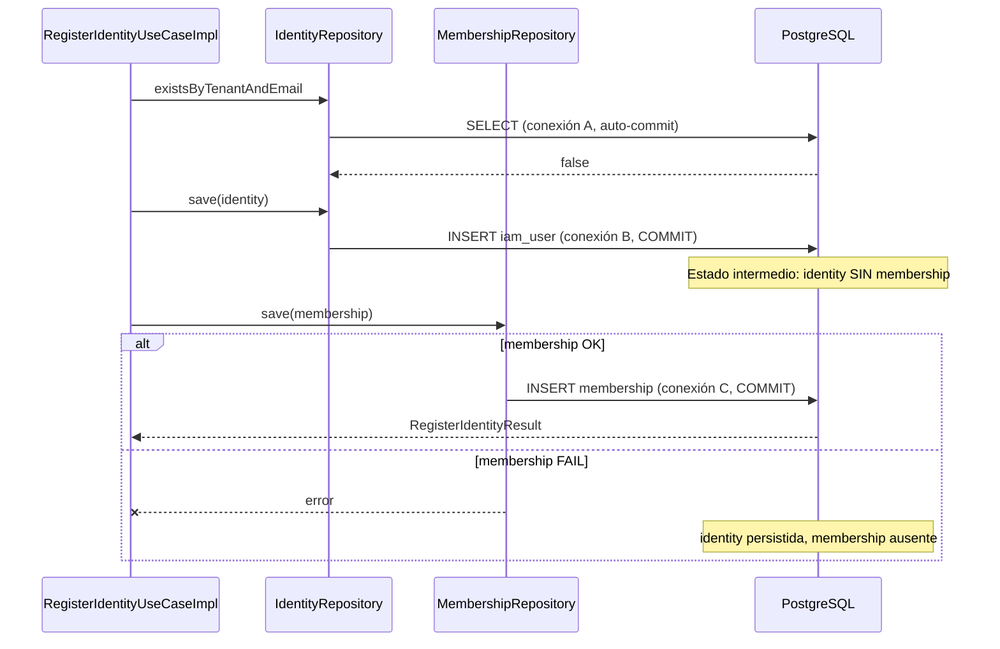

# PASO 12.6 — Transactional Consistency Audit

**Fecha:** 2026-06-03  
**Alcance:** Auditoría de capacidad transaccional reactiva. **Sin cambios de código, beans ni dependencias.**

**Problema de partida:** `RegisterIdentityUseCaseImpl` encadena `save(identity)` → `save(membership)` con `flatMap` sin transacción explícita. Si el segundo paso falla, la identity queda persistida sin membership → login 403 (mitigable por V8 backfill, pero inconsistencia en tiempo real).

---

## 1. Resumen ejecutivo

| Hallazgo | Conclusión |
|----------|------------|
| Infraestructura transaccional explícita | **Ausente** en el proyecto |
| Auto-config Spring Boot R2DBC | **Presente** en runtime (`ConnectionFactory`, `R2dbcTransactionManager` disponibles pero no usados) |
| `platform-r2dbc` | Módulo de **dependencias**; sin `@Configuration` propia |
| Patrón dominante | `Mono`/`flatMap` secuencial sin unidad transaccional |
| Riesgo actual | Bajo en frecuencia, **alto en impacto funcional** (identity huérfana) |
| **Recomendación 12.7** | **Opción A — `TransactionalOperator`** (con bean en capa platform/config) |

---

## 2. Infraestructura R2DBC

### 2.1 Módulo `platform-r2dbc`

**Contenido actual:** solo `build.gradle.kts` — agrega:

- `platform-postgres`
- `libs.r2dbc.postgresql`
- `libs.reactor.core`

**No contiene:** clases Java/Kotlin, `@Configuration`, beans de transacción, `DatabaseClient` custom.

### 2.2 Módulo `platform-postgres`

**Contenido actual:** dependencias JDBC/Flyway (`postgresql`, `flyway-core`) para migraciones y Flyway en `codecore-api`. **Sin** configuración R2DBC.

### 2.3 Configuración Spring en runtime

| Origen | Qué aporta |
|--------|------------|
| `spring-boot-starter-data-r2dbc` (IAM + codecore-api) | Auto-config: `ConnectionFactory`, `R2dbcEntityTemplate`, **`R2dbcTransactionManager`**, repositorios reactivos |
| `application-dev.yml` | `spring.r2dbc.url`, username, password |
| `IamModuleConfiguration` | `@EnableR2dbcRepositories` — escaneo de `SpringDataIam*Repository` |
| Flyway | JDBC separado (`spring.flyway.url`); **no participa** en transacciones R2DBC |

### 2.4 Respuestas directas

| Pregunta | Respuesta |
|----------|-----------|
| ¿Existe `ReactiveTransactionManager`? | **No como bean custom.** Spring Boot registra **`R2dbcTransactionManager`**, que implementa `ReactiveTransactionManager`, vía auto-config cuando hay `ConnectionFactory` |
| ¿Existe `R2dbcTransactionManager`? | **Sí, implícito** (auto-config Boot 3.5.4). **No referenciado** en código del proyecto |
| ¿Existe `TransactionalOperator`? | **No** — ningún `@Bean` ni uso |
| ¿Configuración transaccional propia? | **No** — ni en `platform-r2dbc`, ni IAM, ni `codecore-api` |

---

## 3. Uso actual de transacciones en el repositorio

Búsqueda en `*.java`, `*.kt`, `*.kts`:

| Mecanismo | Ocurrencias |
|-----------|-------------|
| `@Transactional` | **0** |
| `TransactionalOperator` | **0** (solo menciones en docs 12.3/12.4) |
| `TransactionTemplate` | **0** |
| `@EnableTransactionManagement` | **0** |

### Patrón dominante

1. **Application layer:** use cases puros (`RegisterIdentityUseCaseImpl`, `CreateTenantUseCaseImpl`, `AuthenticateIdentityUseCaseImpl`) — encadenamiento Reactor.
2. **Infrastructure:** adaptadores `@Repository` delegando en `ReactiveCrudRepository` (Spring Data R2DBC).
3. **Wiring:** beans manuales en `IamModuleConfiguration` (`new RegisterIdentityUseCaseImpl(...)`).
4. **Tests IT:** `@DataR2dbcTest` + Testcontainers; Flyway vía JDBC en `AbstractPostgresIntegrationTest`.

**Módulos afectados por el patrón sin transacción:** principalmente `identity-access-management`; el resto de módulos incluidos en `settings.gradle.kts` aún no tienen persistencia R2DBC activa.

---

## 4. Análisis de `RegisterIdentityUseCaseImpl`

### 4.1 Diagrama de flujo



### 4.2 Código relevante

```98:106:codecore-backend/modules/identity-access-management/src/main/java/com/codecore/iam/application/RegisterIdentityUseCaseImpl.java
        return identityRepository.save(identity)
                .flatMap(saved -> {
                    IdentityTenantMembership membership = IdentityTenantMembership.create(
                            saved.id(),
                            saved.tenantId(),
                            now
                    );
                    return membershipRepository.save(membership).thenReturn(saved);
                })
```

### 4.3 Posibles fallos y estados intermedios

| Paso | Fallo posible | Estado en DB | Efecto funcional |
|------|---------------|--------------|------------------|
| `existsByTenantAndEmail` | Error red/DB | Sin cambios | Registro falla; OK |
| `save(identity)` | Constraint, timeout | Sin fila o fila parcial (raro) | Registro falla |
| **`save(identity)` OK** | — | **`iam_user` insertado** | — |
| `save(membership)` | Constraint, timeout, pool agotado | **Identity sin membership** | Registro falla al cliente; **login futuro 403** |
| Cliente reintenta registro | `existsByTenantAndEmail` = true | Identity sin membership | **409 CONFLICT** — usuario atrapado |

### 4.4 Consistencia actual

| Propiedad | ¿Garantizada? |
|-----------|---------------|
| Atomicidad identity + membership | **No** |
| Aislamiento entre operaciones | **No** (dos commits independientes) |
| Durabilidad por operación | **Sí** (cada `save` confirma por separado) |
| Coherencia con login 12.3 | **Solo si ambos saves OK** |
| Mitigación V8 backfill | Repara **histórico**, no fallo **intra-request** |

---

## 5. Análisis de repositorios

### 5.1 Arquitectura de adaptadores

| Adaptador | Dependencia interna | Tabla |
|-----------|-------------------|-------|
| `R2dbcIdentityRepository` | `SpringDataIamUserRepository` | `iam.iam_user` |
| `R2dbcMembershipRepository` | `SpringDataIamIdentityTenantMembershipRepository` | `iam.identity_tenant_membership` |

Ambos son `@Repository` Spring, instanciados en el mismo contexto de aplicación, inyectados con el **mismo** `ConnectionFactory` (singleton Boot).

### 5.2 ¿Misma conexión / mismo `DatabaseClient`?

| Escenario | Comportamiento |
|-----------|----------------|
| **Sin transacción activa** (hoy) | Cada llamada `ReactiveCrudRepository.save()` obtiene conexión del pool, ejecuta, libera. **Conexiones distintas** entre identity y membership |
| **Con transacción reactiva activa** | Spring Data R2DBC enlaza la conexión al contexto transaccional; **misma conexión** para operaciones dentro del boundary |
| `DatabaseClient` explícito | **No usado** en el proyecto (solo Spring Data repositories) |

### 5.3 Limitaciones para transacciones

1. **Use case no transaccional:** el boundary debe abrirse en application (operator) o infrastructure (`@Transactional` en facades).
2. **Bean `@Bean` manual:** `RegisterIdentityUseCaseImpl` se crea con `new` — **`@Transactional` en la clase no tendría efecto** sin proxy (ver §6 opción B).
3. **`save` con pre-read:** `R2dbcIdentityRepository.save` hace `findByTenantIdAndId` + `save` — **dos round-trips** dentro de la misma transacción si se envuelve (OK, misma TX).
4. **Flyway/JDBC vs R2DBC:** transacciones R2DBC **no** incluyen migraciones ni escrituras JDBC.
5. **Tests `@DataR2dbcTest`:** transacción por test opcional en Spring Boot Test; ITs actuales **no** validan rollback multi-tabla.

---

## 6. Estrategias posibles

### Opción A — `TransactionalOperator`

**Descripción:** Inyectar `TransactionalOperator` (creado desde `R2dbcTransactionManager` auto-configurado) y envolver el bloque:

```java
transactionalOperator.transactional(
    identityRepository.save(identity)
        .flatMap(saved -> membershipRepository.save(membership).thenReturn(saved))
);
```

| | |
|--|--|
| **Ventajas** | Idiomático Reactor; control explícito del boundary; rollback automático en error; encaja con use cases que ya devuelven `Mono`; testeable mockeando operator o integración real |
| **Desventajas** | Dependencia Spring Transaction en application layer **o** indirección vía puerto `TransactionRunner` |
| **Alineación hexagonal** | **Alta** si el operator se inyecta desde configuration y el use case solo recibe una abstracción (`TransactionalOperator` o puerto `UnitOfWork`) |

### Opción B — `@Transactional` reactivo

**Descripción:** Anotar método que ejecuta ambos saves.

| | |
|--|--|
| **Ventajas** | Declarativo; familiar en Spring |
| **Desventajas** | **No funciona** en el wiring actual: `@Bean return new RegisterIdentityUseCaseImpl()` no es proxy transaccional; requiere `@Service` + proxy por interfaz o `AspectJ`; `@Transactional` en repositorios no agrupa **dos** repositorios distintos fácilmente desde fuera; reactive `@Transactional` exige que todo el chain se suscriba dentro del contexto transaccional |
| **Alineación hexagonal** | **Media-baja** — acopla framework a application o fuerza facades en infrastructure |

### Opción C — Compensación manual

**Descripción:** Si `save(membership)` falla → `identityRepository.delete(tenantId, identityId)`.

| | |
|--|--|
| **Ventajas** | Sin infra transaccional nueva; use case sigue “puro” en apariencia |
| **Desventajas** | **No es atómica** (ventana entre commit identity y delete); delete puede fallar → inconsistencia peor; lógica duplicada; carreras con reintentos cliente; anti-patrón saga sin outbox |
| **Alineación hexagonal** | **Baja** — lógica de consistencia distribuida ad hoc en application |

### Tabla comparativa

| Criterio | A — Operator | B — @Transactional | C — Compensación |
|----------|--------------|--------------------|--------------------|
| Atomicidad real | Sí | Sí (si proxy OK) | No |
| Cambio mínimo | Medio | Alto (refactor beans) | Bajo |
| Riesgo regresión | Bajo | Medio | Alto |
| Encaje WebFlux/R2DBC | Excelente | Aceptable | Pobre |
| Encaje hexagonal | Alto (con puerto opcional) | Medio | Bajo |

---

## 7. Recomendación final

**Elegir Opción A — `TransactionalOperator`.**

**Justificación:**

1. Es el mecanismo **oficial Spring** para transacciones reactivas con R2DBC cuando el código ya usa `Mono`/`Flux`.
2. **No requiere** convertir use cases en `@Service` proxificados ni cambiar el patrón `@Bean` actual más allá de inyectar el operator.
3. Garantiza **commit/rollback único** sobre `iam_user` + `identity_tenant_membership` en la misma conexión.
4. `R2dbcTransactionManager` **ya está** en el classpath vía auto-config; 12.7 solo expone `TransactionalOperator` (mínimo: 1 bean en platform o IAM config).
5. Opción C queda descartada: peor garantía y peor operabilidad que V8 backfill reactivo.

**Variante hexagonal recomendada (12.7):** definir puerto outbound mínimo, p. ej. `ReactiveTransactionExecutor` en `application.port.out`, implementado en `infrastructure` con `TransactionalOperator` — mantiene application libre de imports Spring si se desea pureza estricta. Si se prioriza pragmatismo, inyectar `TransactionalOperator` directamente en `RegisterIdentityUseCaseImpl` es aceptable en CodeCore (application ya depende de Reactor).

**Alcance 12.7:** aplicar transacción **solo** a `RegisterIdentityUseCaseImpl.register()` — no login, no JWT, no Tenant Context.

---

## 8. Impacto previsto — PASO 12.7 (sin implementar)

### 8.1 Configuración

| Artefacto | Cambio propuesto |
|-----------|------------------|
| `platform-r2dbc` **o** `IamModuleConfiguration` / nueva `IamR2dbcConfiguration` | `@Bean TransactionalOperator` desde `R2dbcTransactionManager` |
| `codecore-api` | Sin cambio si el bean vive en módulo importado |
| `@EnableTransactionManagement` | Opcional (operator no lo exige); recomendable si futuros `@Transactional` en infrastructure |

### 8.2 Use cases

| Artefacto | Cambio |
|-----------|--------|
| `RegisterIdentityUseCaseImpl` | Envolver `save(identity)` + `save(membership)` en boundary transaccional |
| `RegisterIdentityUseCase` (interface) | Sin cambio de contrato |
| `AuthenticateIdentityUseCaseImpl` | **Sin cambio** (restricción) |
| `CreateTenantUseCaseImpl` | Sin cambio (un solo aggregate; candidato futuro) |

### 8.3 Repositorios

| Artefacto | Cambio |
|-----------|--------|
| `R2dbcIdentityRepository` | **Sin cambio** de API; participará en TX automáticamente |
| `R2dbcMembershipRepository` | **Sin cambio** |
| Puertos `IdentityRepository` / `MembershipRepository` | **Sin cambio** |

### 8.4 Tests

| Test | Cambio propuesto |
|------|------------------|
| `RegisterIdentityUseCaseTest` | Mock de operator o verificar que se invoca boundary transaccional |
| `RegisterIdentityUseCaseIT` | Nuevo caso: simular fallo en membership → assert **0 filas** `iam_user` (rollback) — requiere test double o constraint violation controlada |
| ITs existentes login/membership | Sin cambio |
| `@DataR2dbcTest` configs | Posible `@Import` del bean transaccional |

### 8.5 Integración / docs

| Entregable | Acción |
|------------|--------|
| `PASO-12.7-TRANSACTIONAL-REGISTRATION.md` | Documentar implementación |
| `PASO-12.3-MEMBERSHIP-INTEGRATION.md` | Actualizar deuda “sin transacción” → resuelta |
| Flyway | **Sin cambios** |

---

## 9. Riesgos

### 9.1 Si no se implementa 12.7

| Riesgo | Severidad |
|--------|-----------|
| Identity sin membership en fallo parcial | Media (frecuencia baja) |
| Usuario bloqueado: 409 en reintento + 403 en login | Alta (impacto UX) |
| Dependencia operativa de V8/repair manual | Media |

### 9.2 Si se implementa 12.7 mal

| Riesgo | Mitigación |
|--------|------------|
| Operator fuera del chain Reactor (no participa TX) | Envolver todo el `Mono` de registro; tests IT rollback |
| `@Transactional` mal aplicado (sin efecto) | Evitar opción B con beans actuales |
| Deadlocks multi-tabla | Bajo riesgo (2 INSERTs mismo schema); orden consistente identity → membership |
| Performance | Despreciable (1 TX vs 2 commits) |

---

## 10. Conclusión

El proyecto **tiene la infraestructura transaccional R2DBC de Spring Boot disponible pero inactiva**. El registro de identidad es **secuencialmente correcto** en el flujo feliz, pero **no atómico**. La solución alineada con WebFlux, R2DBC y la arquitectura actual es **`TransactionalOperator` en el PASO 12.7**, limitada a `RegisterIdentityUseCaseImpl`, sin tocar login, JWT, Flyway ni Tenant Context.

---

## 11. Referencias

| Documento / código | Relación |
|--------------------|----------|
| `PASO-12.3-MEMBERSHIP-INTEGRATION-AUDIT.md` | Deuda transaccional originaria |
| `PASO-12.4-MEMBERSHIP-BACKFILL-AUDIT.md` | Mitigación datos, no atomicidad |
| `PASO-12.5-MEMBERSHIP-BACKFILL-MIGRATION.md` | V8 backfill |
| `RegisterIdentityUseCaseImpl.java` | Punto de fallo |
| `platform-r2dbc/build.gradle.kts` | Sin config transaccional |
| Spring Boot 3.5.4 — `R2dbcDataAutoConfiguration` | Auto-registro `R2dbcTransactionManager` |
