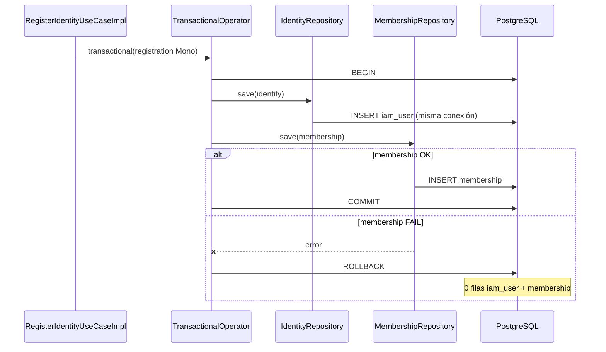

# PASO 12.7 — Transactional Registration

**Fecha:** 2026-06-03

---

## 1. Objetivo

Garantizar atomicidad entre `save(identity)` y `save(membership)` en el registro de identidad, sin cambiar login, JWT ni APIs.

---

## 2. Implementación

### 2.1 Bean `TransactionalOperator`

**Clase:** `com.codecore.platform.r2dbc.PlatformR2dbcAutoConfiguration`

**Registro:** `META-INF/spring/org.springframework.boot.autoconfigure.AutoConfiguration.imports`

```java
@Bean
@ConditionalOnMissingBean
TransactionalOperator transactionalOperator(ReactiveTransactionManager transactionManager) {
    return TransactionalOperator.create(transactionManager);
}
```

| Aspecto | Detalle |
|---------|---------|
| `ReactiveTransactionManager` | Auto-configurado por Spring Boot (`R2dbcTransactionManager`) cuando existe `ConnectionFactory` |
| Reutilizable | Cualquier módulo con `platform-r2dbc` + `spring-boot-starter-data-r2dbc` |
| Condición | `@ConditionalOnBean(ReactiveTransactionManager.class)` — no falla si no hay R2DBC |

**Módulo `platform-r2dbc`:** plugin `codecore.spring-boot-library`; dependencias mínimas (`spring-boot-autoconfigure`, `spring-r2dbc`, `spring-tx`, `r2dbc-postgresql`).

### 2.2 `RegisterIdentityUseCaseImpl`

Solo el bloque de persistencia queda dentro del boundary transaccional:

```java
Mono<RegisterIdentityResult> registration = identityRepository.save(identity)
        .flatMap(saved -> {
            IdentityTenantMembership membership = IdentityTenantMembership.create(...);
            return membershipRepository.save(membership).thenReturn(saved);
        })
        .map(saved -> new RegisterIdentityResult(...));

return transactionalOperator.transactional(registration);
```

**Sin cambios:** validaciones, `existsByTenantAndEmail`, hash de password, DTO de salida.

**Wiring:** `IamModuleConfiguration.registerIdentityUseCase(..., TransactionalOperator)`.

---

## 3. Flujo transaccional



### Verificaciones documentadas

| Propiedad | Comportamiento |
|-----------|----------------|
| **Conexión única en TX** | Spring R2DBC enlaza la conexión al contexto transaccional; repositorios Spring Data participan en la misma transacción |
| **Rollback automático** | Error en cualquier operación del `Mono` → rollback de toda la transacción |
| **Compatibilidad R2DBC** | `TransactionalOperator` + `R2dbcTransactionManager` — patrón recomendado Spring para WebFlux |

---

## 4. Pruebas

### 4.1 Unitarios — `RegisterIdentityUseCaseTest`

- Mock `TransactionalOperator` con `lenient().when(transactional(...)).thenAnswer(inv -> inv.getArgument(0))`.
- Comportamiento funcional del registro exitoso sin cambios.

### 4.2 Integración — `RegisterIdentityUseCaseIT`

- Import `IamR2dbcTestConfiguration` (expone `PlatformR2dbcAutoConfiguration`).
- Registro feliz: sin regresión.

### 4.3 Rollback — `RegisterIdentityTransactionalRollbackIT`

| Paso | Acción |
|------|--------|
| 1 | `@Primary` `MembershipRepository` que falla en `save` |
| 2 | Ejecutar `RegisterIdentityUseCase.execute` |
| 3 | Assert error `IllegalStateException` |
| 4 | JDBC: **0** filas en `iam.iam_user` y **0** en `iam.identity_tenant_membership` para el email |

**Evidencia rollback (criterio de aceptación):** test `shouldRollbackIdentityWhenMembershipSaveFails` — **PASSED**.

---

## 5. Resultados de tests

```
RegisterIdentityTransactionalRollbackIT > shouldRollbackIdentityWhenMembershipSaveFails PASSED
RegisterIdentityUseCaseIT (4 tests) PASSED
RegisterIdentityUseCaseTest (5 tests) PASSED
:modules:identity-access-management:test BUILD SUCCESSFUL
```

---

## 6. Artefactos modificados

| Artefacto | Cambio |
|-----------|--------|
| `PlatformR2dbcAutoConfiguration.java` | **Nuevo** — bean `TransactionalOperator` |
| `AutoConfiguration.imports` | **Nuevo** |
| `platform-r2dbc/build.gradle.kts` | Plugin Spring + deps transaccionales |
| `RegisterIdentityUseCaseImpl.java` | Boundary transaccional |
| `IamModuleConfiguration.java` | Inyección `TransactionalOperator` |
| `IamR2dbcTestConfiguration.java` | **Nuevo** — import auto-config en ITs |
| `RegisterIdentityTransactionalRollbackIT.java` | **Nuevo** |
| Tests IT/HTTP configs | + `IamR2dbcTestConfiguration` |

**Sin modificar:** `AuthenticateIdentityUseCaseImpl`, repositorios, Flyway, JWT, login HTTP.

---

## 7. Riesgos residuales

| Riesgo | Estado |
|--------|--------|
| Registro parcial identity/membership | **Mitigado** en flujo de registro |
| Fallo post-commit (imposible rollback) | Fuera de alcance TX (p. ej. respuesta HTTP tras commit) |
| Otros use cases multi-persistencia | Sin TX (p. ej. `CreateTenantUseCase` — un solo save) |

---

## 8. Referencias

- `PASO-12.6-TRANSACTIONAL-CONSISTENCY-AUDIT.md`
- Spring Boot 3.5 — R2DBC transaction management
