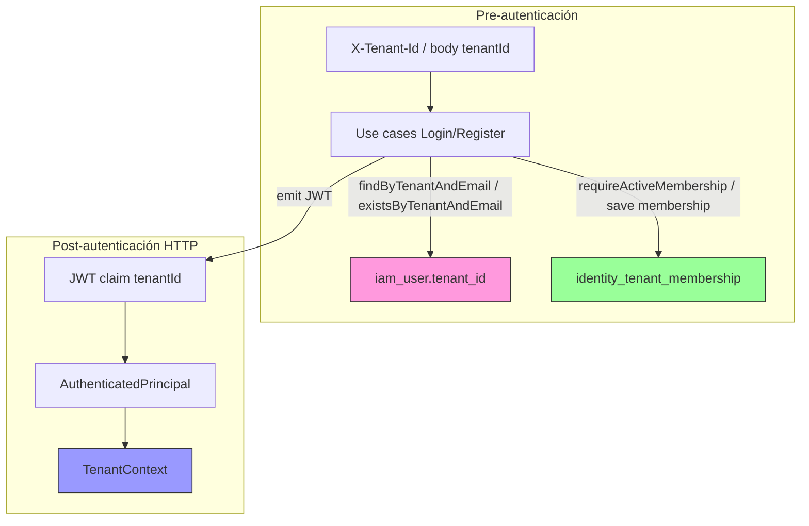

# PASO 13.0 — Tenant-Aware Operations Audit

**Fecha:** 2026-06-03  
**Alcance:** Auditoría exhaustiva de dependencias de tenancy. **Sin cambios de código, SQL, Flyway ni implementaciones.**

**Estado previo verificado:** PASO 12.1–12.9 completados (Membership, JWT tenant claim, Tenant Context).

---

## 1. Resumen ejecutivo

CodeCore opera hoy con un **modelo híbrido de tres capas** para tenancy:

| Capa | Mecanismo | Rol operativo |
|------|-----------|---------------|
| Legacy | `iam.iam_user.tenant_id` | Lookup, unicidad, persistencia de identidad |
| Membership | `iam.identity_tenant_membership` | Pertenencia formal N:M; gate en login y registro |
| Tenant Context | JWT → `AuthenticatedPrincipal` → Reactor Context | Tenant de request autenticada (sin BD) |

**Decisión final:** **NO** — CodeCore **no está listo** para eliminar `iam_user.tenant_id` hoy.

La columna sigue siendo **load-bearing** en registro, login, persistencia, restricciones DB y modelo de dominio. Membership y Tenant Context cubren capas adicionales pero **no sustituyen** el lookup ni la unicidad que hoy ancla `iam_user.tenant_id`.

---

## 2. Inventario de dependencias

Búsqueda en todo el repositorio (`tenant_id`, `tenantId`, `findByTenant`, `existsByTenant`, `TenantId`) — **~120 archivos** con ocurrencias. Clasificación por artefactos de producción y tests.

### 2.1 Producción — Persistencia y schema

| Archivo | Tipo | Rol | Dependencia | Riesgo |
|---------|------|-----|-------------|--------|
| `apps/codecore-api/.../V2__create_iam_user_table.sql` | Migración | Escritura/lectura — columna `NOT NULL`, índice, `UNIQUE (tenant_id, normalized_email)` | `tenant_id` | **Alto** |
| `apps/codecore-api/.../V7__create_identity_tenant_membership_table.sql` | Migración | Escritura — `tenant_id` en membership | Membership | Medio |
| `apps/codecore-api/.../V8__backfill_identity_tenant_membership.sql` | Migración | Lectura `u.tenant_id` para backfill | `tenant_id` + Membership | Medio |
| `IamUserEntity.java` | Entity | Lectura/escritura — mapeo columna `tenant_id` | `tenant_id` | **Alto** |
| `IamUserMapper.java` | Mapper | Lectura/escritura — `toDomain`/`toEntity` con `tenantId` | `tenant_id` | **Alto** |
| `SpringDataIamUserRepository.java` | Repository | Lectura — `findByTenantIdAnd*`, `existsByTenantIdAnd*` | `tenant_id` | **Alto** |
| `R2dbcIdentityRepository.java` | Repository | Lectura/escritura — todos los métodos acotados por tenant | `tenant_id` | **Alto** |
| `IamIdentityTenantMembershipEntity.java` | Entity | Lectura/escritura — `tenant_id` en membership | Membership | Medio |
| `SpringDataIamIdentityTenantMembershipRepository.java` | Repository | Lectura — `findByTenantId`, `existsByIdentityIdAndTenantId` | Membership | Medio |
| `R2dbcMembershipRepository.java` | Repository | Lectura/escritura membership por tenant | Membership | Medio |

### 2.2 Producción — Dominio

| Archivo | Tipo | Rol | Dependencia | Riesgo |
|---------|------|-----|-------------|--------|
| `AggregateRoot.java` | Domain | `tenantId()` en todos los aggregates IAM | `tenant_id` (modelo) | **Alto** |
| `Identity.java` | Domain | Constructor recibe `TenantId`; hereda de `AggregateRoot` | `tenant_id` (modelo) | **Alto** |
| `IdentityTenantMembership.java` | Domain | Asociación identity ↔ tenant | Membership | Medio |
| `Session.java`, `LoginAttemptTracker.java`, `FailedLoginAttempt.java`, `PasswordResetRequest.java` | Domain | Aggregates futuros con `TenantId` | `tenant_id` (modelo) | Medio |
| `TenantId.java` | Value Object | Identificador transversal | Transversal | Bajo |
| `IdentityAlreadyExistsException.java` | Exception | Documenta unicidad `tenant_id + normalized_email` | `tenant_id` | Medio |

### 2.3 Producción — Puertos y use cases

| Archivo | Tipo | Rol | Dependencia | Riesgo |
|---------|------|-----|-------------|--------|
| `IdentityRepository.java` | Port | API tenant-scoped: `findByTenantAndEmail`, `existsByTenantAndEmail`, `findById(tenant, id)` | `tenant_id` | **Alto** |
| `MembershipRepository.java` | Port | `exists`, `findByIdentityId`, `findByTenantId` | Membership | Medio |
| `AuthenticateIdentityUseCaseImpl.java` | UseCase | Login: lookup `findByTenantAndEmail` → membership → JWT | `tenant_id` + Membership | **Alto** |
| `RegisterIdentityUseCaseImpl.java` | UseCase | Registro: `existsByTenantAndEmail` → save identity + membership | `tenant_id` + Membership | **Alto** |
| `AuthenticationCommand.java` | Command | `TenantId tenantId` obligatorio | `tenant_id` (input) | **Alto** |
| `RegisterIdentityCommand.java` | Command | `TenantId tenantId` obligatorio | `tenant_id` (input) | **Alto** |
| `SessionRepository.java`, `LoginAttemptRepository.java`, `PasswordResetRepository.java` | Port | Operaciones futuras tenant-scoped | `tenant_id` (diseño) | Medio |
| `TenantContext.java` | Port | `currentTenant()` desde JWT | TenantContext | Bajo |
| `ReactorTenantContext.java` | Adapter | Implementación TenantContext | TenantContext | Bajo |

### 2.4 Producción — HTTP y seguridad

| Archivo | Tipo | Rol | Dependencia | Riesgo |
|---------|------|-----|-------------|--------|
| `AuthenticationController.java` | Controller | Login: header `X-Tenant-Id` → `AuthenticationCommand` | `tenant_id` (input) | **Alto** |
| `RegisterIdentityController.java` | Controller | Body `tenantId` → `RegisterIdentityCommand` | `tenant_id` (input) | **Alto** |
| `RegisterIdentityRequest.java` | DTO | Campo `@NotNull UUID tenantId` | `tenant_id` (input) | **Alto** |
| `JwtAuthenticationWebFilter.java` | Filter | Propaga principal; **no** consulta BD | TenantContext (indirecto) | Bajo |
| `JwtTokenProvider.java` | Security | Emite claim `tenantId` en JWT | JWT (no BD) | Medio |
| `JwtTokenValidator.java` | Security | Parsea claim `tenantId` → `AuthenticatedPrincipal` | JWT (no BD) | Medio |
| `AuthenticatedPrincipal.java` | DTO | `Optional<TenantId> tenantId` | JWT / TenantContext | Medio |
| `AccessTokenClaims.java` | DTO | `String tenantId` obligatorio en emisión | JWT | Medio |

### 2.5 Tests (inventario agrupado)

| Grupo | Archivos | Rol | Dependencia | Riesgo |
|-------|----------|-----|-------------|--------|
| Auth use case | `AuthenticateIdentityUseCaseTest`, `AuthenticateIdentityUseCaseIT` | Login + membership + JWT | `tenant_id` + Membership | **Alto** |
| Register use case | `RegisterIdentityUseCaseTest`, `RegisterIdentityUseCaseIT`, `RegisterIdentityTransactionalRollbackIT` | Registro transaccional | `tenant_id` + Membership | **Alto** |
| Identity repo IT | `R2dbcIdentityRepositoryIT` | CRUD tenant-scoped | `tenant_id` | **Alto** |
| Membership IT | `R2dbcMembershipRepositoryIT`, `MembershipBackfillMigrationIT` | Membership + backfill | Membership + `tenant_id` | Medio |
| HTTP IT | `AuthenticationControllerIT`, `AuthenticationMeControllerIT`, `RegisterIdentityControllerIT` | E2E login/registro | `tenant_id` + JWT | **Alto** |
| JWT / Context | `JwtToken*Test`, `JwtAuthenticationWebFilterTest`, `ReactorTenantContextTest` | Token y contexto | JWT / TenantContext | Medio |
| Test support | `IamTestMembershipSupport`, configs IT | Helpers con `saved.tenantId()` | `tenant_id` | Medio |

### 2.6 Documentación y especificaciones

| Ubicación | Relevancia |
|-----------|------------|
| `docs/audits/PASO-10.x` – `PASO-12.9` | Historial de decisiones; 12.4 documenta doble fuente de verdad |
| `codecore-specifications/.../repositories.md` | Define `findByTenantAndEmail` como operación oficial |
| `codecore-specifications/.../security-rules.md` | Flujo login tenant-aware |
| `codecore-specifications/.../ADR-003` | Estrategia multi-tenant |
| `.cursor/architecture.md` | Referencia arquitectónica |

**Nota:** No existen módulos fuera de `identity-access-management` con código Java que dependa de `iam_user.tenant_id`. Toda la deuda está concentrada en IAM.

---

## 3. Auditoría de autenticación

### 3.1 Artefactos analizados

| Artefacto | Rol en login |
|-----------|--------------|
| `AuthenticateIdentityUseCaseImpl` | Orquestación: lookup → credenciales → membership → JWT |
| `IdentityRepository` / `R2dbcIdentityRepository` | Lookup `findByTenantAndEmail` sobre `iam_user` |
| `MembershipRepository` / `R2dbcMembershipRepository` | `findByIdentityId` + filtro tenant + status ACTIVE |
| `JwtAuthenticationWebFilter` | Valida JWT en requests; no participa en login |
| `TenantContext` / `ReactorTenantContext` | Resuelve tenant post-auth desde JWT; no participa en login |

### 3.2 Flujo actual

```
POST /api/v1/auth/login
  Header: X-Tenant-Id
  Body: email, password
    ↓
AuthenticationCommand(tenantId, email, password)
    ↓
identityRepository.findByTenantAndEmail(tenantId, email)     ← iam_user.tenant_id
    ↓ (vacío → 401 Invalid credentials)
validar status ACTIVE + password
    ↓
membershipRepository.findByIdentityId(identity.id())
  .filter(m → m.tenantId().equals(tenantId) && ACTIVE)      ← identity_tenant_membership
    ↓ (vacío/inactivo → 403 Not member)
tokenProvider.generateAccessToken(tenantId del comando)     ← JWT claim tenantId
```

### 3.3 Preguntas de auditoría

#### 1. ¿Qué parte del login sigue dependiendo de `tenant_id`?

| Paso | Dependencia |
|------|-------------|
| Resolución de identidad por email | **`iam_user.tenant_id`** vía `findByTenantAndEmail` |
| Entrada HTTP | Header **`X-Tenant-Id`** |
| Emisión JWT | `tenantId` del **comando** (coherente con lookup, no leído de membership) |
| Validación membership | **`identity_tenant_membership.tenant_id`** (independiente de columna en `iam_user`) |
| Post-login HTTP | JWT claim → `TenantContext` (sin BD) |

El cuello de botella legacy está en el **primer paso**: sin fila `iam_user` con `(tenant_id, normalized_email)` coincidente, el login termina en 401 aunque exista membership válida en otro escenario de datos inconsistentes.

#### 2. ¿Puede eliminarse hoy?

**No.** Eliminar la columna o dejar de usarla en lookup rompe el flujo de login y registro sin sustituto implementado.

#### 3. ¿Qué fallaría si se elimina?

| Componente | Fallo |
|------------|-------|
| `SpringDataIamUserRepository` | Queries `findByTenantIdAnd*` inválidas |
| `AuthenticateIdentityUseCaseImpl` | No encuentra identidad → 401 universal |
| `RegisterIdentityUseCaseImpl` | No puede verificar duplicados ni persistir |
| Constraint `uq_iam_user_tenant_normalized_email` | Eliminada o incoherente |
| `Identity` / `IamUserMapper` | Modelo roto — `tenantId` obligatorio en aggregate |
| Test suite IAM | Fallo masivo (~15+ clases IT/unit) |
| Mismo email en tenants distintos | Comportamiento actual (2 filas `iam_user`) dejaría de ser posible sin rediseño |

#### 4. ¿Qué consultas deben reescribirse?

| Consulta actual | Sustituto propuesto (13.1+) |
|-----------------|----------------------------|
| `findByTenantIdAndNormalizedEmail(tenant, email)` | Lookup global por email **o** join membership+user |
| `existsByTenantIdAndNormalizedEmail(tenant, email)` | `membershipRepository.exists(identityId, tenant)` tras resolver identity |
| `findByTenantIdAndId(tenant, id)` | `findById(identityId)` + validación membership **o** `TenantContext` |
| `save(identity)` con `tenant_id` | Insert sin columna; membership como única fuente de pertenencia |

#### 5. ¿Qué tests quedarían rotos?

- `AuthenticateIdentityUseCaseTest` (6 tests — mock `findByTenantAndEmail`)
- `AuthenticateIdentityUseCaseIT` (8+ escenarios incl. membership missing/inactive)
- `AuthenticationControllerIT`, `AuthenticationMeControllerIT`
- `JwtTokenProviderTest`, `JwtTokenValidatorTest` (parcial — claim sigue válido)
- `R2dbcIdentityRepositoryIT` (completo)
- Helpers IT que usan `persistIdentityOnly(tenantId, ...)`

---

## 4. Auditoría de registro

### 4.1 Flujo actual

```
RegisterIdentityCommand(tenantId, email, password)
    ↓
identityRepository.existsByTenantAndEmail(tenantId, email)   ← iam_user.tenant_id
    ↓
new Identity(..., tenantId, ...)                             ← dominio
identityRepository.save(identity)                            ← INSERT con tenant_id
    ↓
membershipRepository.save(ACTIVE, mismo tenantId)            ← membership
    ↓ (TransactionalOperator — atomicidad 12.7)
RegisterIdentityResult(identityId, tenantId, ...)
```

### 4.2 Preguntas de auditoría

#### 1. ¿Registro sigue usando `tenant_id`?

**Sí**, en tres puntos: unicidad (`existsByTenantAndEmail`), aggregate `Identity`, persistencia `IamUserEntity.tenant_id`.

#### 2. ¿Puede funcionar solo con membership?

**Parcialmente, no hoy.** Membership ya se crea en registro, pero:

- La unicidad de email está anclada a `(tenant_id, normalized_email)` en `iam_user`, no a membership.
- El test `shouldAllowSameEmailInDifferentTenants` demuestra el modelo **1 fila iam_user por tenant+email** (dos `identity_id` distintos), no identidad global N:M real.
- Sin `iam_user.tenant_id`, haría falta decidir: ¿email único global? ¿identidad global con N memberships?

#### 3. ¿Qué cambios serían necesarios?

| Área | Cambio |
|------|--------|
| Unicidad | Migrar de `UNIQUE(tenant_id, email)` a regla vía membership o email global |
| `RegisterIdentityUseCaseImpl` | `exists` vía membership; identity sin tenant embebido |
| Dominio | Refactor `Identity` / `AggregateRoot` — tenant fuera del aggregate o derivado |
| API | Posible simplificación de `tenantId` en body si el tenant viene de contexto |
| Transacción | Mantener atomicidad identity + membership (ya resuelto en 12.7) |

---

## 5. Auditoría de repositorios IAM

### Grupo A — Dependen directamente de `iam_user.tenant_id`

| Repositorio | Métodos afectados |
|-------------|-------------------|
| `IdentityRepository` (port) | Todos los métodos reciben `TenantId` |
| `R2dbcIdentityRepository` | `save`, `findById`, `findByTenantAndEmail`, `existsByTenantAndEmail`, `delete` |
| `SpringDataIamUserRepository` | `findByTenantIdAndNormalizedEmail`, `existsByTenantIdAndNormalizedEmail`, `findByTenantIdAndId` |
| `IamUserMapper` / `IamUserEntity` | Mapeo bidireccional `tenant_id` |

### Grupo B — Podrían migrarse a Membership

| Repositorio / Use case | Estado | Migración |
|------------------------|--------|-----------|
| `AuthenticateIdentityUseCaseImpl` (gate membership) | **Ya usa** Membership post-lookup | Sustituir lookup inicial |
| `RegisterIdentityUseCaseImpl` (creación membership) | **Ya usa** Membership en save | Sustituir `existsByTenantAndEmail` |
| `MembershipRepository.findByTenantId` | Disponible | Login alternativo: listar identities por tenant vía membership |
| Unicidad registro | Hoy en `iam_user` | `membershipRepository.exists` + política email |

### Grupo C — Ya pueden usar TenantContext

| Componente | Estado |
|------------|--------|
| `ReactorTenantContext` | Implementado (12.9) |
| Consumidores en producción | **Ninguno** — ningún use case inyecta `TenantContext` aún |
| `JwtAuthenticationWebFilter` | No usa tenant para autorización de rutas |
| Futuros use cases autenticados | Deberían usar `TenantContext.currentTenant()` en lugar de re-leer BD |

**Repositorios sin implementación R2DBC aún** (`SessionRepository`, `LoginAttemptRepository`, `PasswordResetRepository`) están diseñados tenant-scoped en el port — al implementarlos conviene usar TenantContext + Membership, no reintroducir dependencia en `iam_user.tenant_id`.

---

## 6. Tenant Source Of Truth

### Decisión: **Opción C — Modelo híbrido**

| Fuente | Rol real hoy | ¿Source of truth? |
|--------|--------------|-------------------|
| `iam_user.tenant_id` | Lookup login/registro, unicidad, persistencia aggregate | **Sí — operacional (legacy)** |
| `identity_tenant_membership` | Autorización de pertenencia en login/registro | **Sí — pertenencia formal** |
| JWT `tenantId` claim | Contexto de request autenticada | **Sí — runtime HTTP post-login** |
| `TenantContext` | Acceso programático al tenant JWT | **Sí — request scope (sin BD)** |

### Justificación

1. **Login usa ambas tablas en secuencia:** primero `iam_user.tenant_id` (credenciales), luego membership (pertenencia). Ninguna sola fuente gobierna todo el flujo.
2. **Pueden divergir** (documentado en PASO 12.4): identity con `tenant_id=A` y membership solo en `B` → 403 en login tenant A; membership en B sin fila `iam_user` en B → 401.
3. **V8 backfill** alinea datos históricos copiando `iam_user.tenant_id` → membership, pero no elimina la columna legacy ni unifica el modelo.
4. **N:M real no materializado:** mismo email en dos tenants = dos filas `iam_user` con distintos `identity_id` (test `shouldAllowSameEmailInDifferentTenants`). Membership es N:M a nivel de tabla, pero identidad sigue siendo 1:1 con tenant en `iam_user`.
5. **TenantContext** no consulta BD — refleja lo emitido en login, que a su vez dependió del comando/`iam_user`.

**Conclusión:** La fuerte convergencia deseada (`identity_tenant_membership` como única fuente) **aún no está completada**. `iam_user.tenant_id` sigue siendo load-bearing.

---

## 7. Plan de migración (roadmap 13.1–13.4)

### 13.1 — Identity Lookup Migration

**Objetivo:** Desacoplar resolución de identidad de `iam_user.tenant_id`.

| Cambios requeridos | Detalle |
|--------------------|---------|
| Nuevo método port | `findByEmail(EmailAddress)` o `findByIdentityId` sin tenant |
| Login lookup | `(tenantId, email)` → resolver identity por email + validar membership `(identityId, tenantId)` |
| Registro unicidad | Reemplazar `existsByTenantAndEmail` por check membership + regla de email acordada |
| Decisión de producto | Email global único vs. mismo email multi-tenant (identidades separadas vs. identidad global) |
| Índices DB | Nuevo índice/constraint en `normalized_email` o en membership |
| Specs | Actualizar `repositories.md`, `security-rules.md` |

**Riesgos:**

- Cambio semántico en mismo-email-multi-tenant.
- Performance: join membership + user vs. índice compuesto actual.
- Datos inconsistentes pre-migración bloquean login hasta reconciliación.

**Criterios de aceptación:**

- [ ] Login exitoso sin `findByTenantAndEmail` en código de producción.
- [ ] Registro exitoso sin `existsByTenantAndEmail`.
- [ ] IT equivalentes pasan con nuevo modelo.
- [ ] Query plan validado en PostgreSQL.

---

### 13.2 — Authentication Refactor

**Objetivo:** Login y JWT basados en membership como gate principal; minimizar trust en `iam_user.tenant_id`.

| Cambios requeridos | Detalle |
|--------------------|---------|
| `AuthenticateIdentityUseCaseImpl` | Reordenar: membership-aware lookup → credenciales |
| JWT emission | `tenantId` derivado de membership validada (no solo del comando) |
| HTTP | Evaluar mantener `X-Tenant-Id` vs. inferir de membership única |
| Errores | Preservar 401 vs 403 (no revelar membership antes de password) |
| Legacy tokens | Plan rotación tokens sin claim (hasta expiración) |

**Riesgos:**

- Timing attacks / enumeración si el orden de validación cambia.
- Tokens legacy sin `tenantId` vs. `TenantContext` estricto (12.9 falla con `TENANT_CLAIM_ABSENT`).

**Criterios de aceptación:**

- [ ] JWT `tenantId` = tenant de membership ACTIVE validada.
- [ ] Tests de membership missing/inactive siguen verdes.
- [ ] No regresión en `AuthenticationControllerIT`.
- [ ] Documentación de transición JWT actualizada.

---

### 13.3 — Tenant Source Of Truth Verification

**Objetivo:** Garantizar consistencia antes de deprecar columna.

| Cambios requeridos | Detalle |
|--------------------|---------|
| Job/query reconciliación | Detectar identity sin membership, membership huérfana, tenant mismatch |
| FK opcionales | `membership.identity_id → iam_user.id`, `membership.tenant_id → iam.tenant` |
| Métricas/alertas | Drift post-deploy |
| Verificación V8 | Queries A/B/C de `V8__backfill_*.sql` en CI o runbook |
| Política escritura | Prohibir insert manual solo en `iam_user` |

**Riesgos:**

- FK en prod con datos sucios bloquea migración.
- Falsos positivos en entornos dev con IT `persistIdentityOnly`.

**Criterios de aceptación:**

- [ ] Query A (identity sin membership canónica) = 0 filas en prod.
- [ ] Query B (membership huérfana) = 0 filas.
- [ ] Procedimiento de remediación documentado.
- [ ] CI incluye check de consistencia (opcional IT dedicado).

---

### 13.4 — Deprecate `iam_user.tenant_id`

**Objetivo:** Eliminar columna y deuda legacy.

| Cambios requeridos | Detalle |
|--------------------|---------|
| Flyway | Migración: drop `tenant_id`, drop `uq_iam_user_tenant_normalized_email`, nuevo constraint email |
| Dominio | `Identity` sin `TenantId` en aggregate / refactor `AggregateRoot` |
| Entity/Mapper | Eliminar campo `IamUserEntity.tenantId` |
| `IdentityRepository` port | API sin parámetro tenant en lookups |
| DTOs/commands | Revisar si `tenantId` sigue en registro público |
| Documentación | Cerrar deuda 12.x; ADR actualizado |
| TenantContext | Consumidores usan JWT como única fuente runtime |

**Riesgos:**

- Migración irreversible sin rollback plan.
- Downtime si constraint change en tabla grande.
- Specs y blueprints desalineados.

**Criterios de aceptación:**

- [ ] Columna `iam_user.tenant_id` eliminada.
- [ ] Cero referencias en código Java/SQL a `iam_user.tenant_id`.
- [ ] `BUILD SUCCESSFUL` + suite IAM completa.
- [ ] PASO 13.0 re-audit confirma **SÍ** eliminable (sanity check futuro).

---

## 8. Análisis de riesgo

### 8.1 Riesgo funcional

| Escenario | Impacto |
|-----------|---------|
| Eliminar columna prematuramente | **Login y registro caídos** — 401/500 en toda IAM |
| Drift identity/membership | Login 403 con credenciales válidas (ya posible hoy) |
| Mismo email multi-tenant | Comportamiento producto cambia si se unifica identidad global |
| Tokens legacy sin `tenantId` | `TenantContext.currentTenant()` falla; rutas que lo adopten antes de rotación JWT rotas |
| Use cases futuros (session, password reset) | Si copian patrón `findByTenantAndEmail`, perpetúan deuda |

### 8.2 Riesgo de seguridad

| Escenario | Evaluación |
|-----------|------------|
| Login en tenant incorrecto con credenciales válidas | **Mitigado hoy:** membership ACTIVE obligatoria para el `tenantId` del comando. Sin membership → 403. |
| JWT con `tenantId` distinto al membership | **Riesgo bajo hoy:** JWT emite el tenant del comando que ya pasó membership gate. No se re-valida membership en cada request — **riesgo futuro** si se confía solo en JWT sin re-check en operaciones sensibles. |
| `iam_user.tenant_id` ≠ membership.tenant_id | Login en tenant del comando falla en membership step → 403, no autentica en tenant incorrecto. **No hay bypass directo.** |
| TenantContext sin claim | Fallo explícito (`TENANT_CLAIM_ABSENT`) — fail-closed en consumidores estrictos. |
| Header `X-Tenant-Id` manipulable | Esperado: atacante debe conocer email+password válidos **y** membership ACTIVE en ese tenant. |

**Conclusión seguridad:** Eliminar `tenant_id` sin refactor **no mejora** seguridad hoy; un refactor mal hecho en lookup podría **aumentar** riesgo de autenticación cross-tenant si membership no se valida correctamente.

### 8.3 Riesgo de datos

| Escenario | Impacto |
|-----------|---------|
| Eliminar columna con datos solo en `iam_user` | Pérdida de información de scope si membership incompleta |
| V8 no ejecutado en prod | Identidades históricas sin membership → login bloqueado (403) |
| Registro parcial pre-12.7 | Identity sin membership (mitigado por transacción desde 12.7) |
| Dos filas mismo email distintos tenants | Modelo actual explícito; migración a identidad global requiere merge plan |

---

## 9. Decisión final

### ¿Está listo CodeCore para eliminar `iam_user.tenant_id` hoy?

## **NO**

### Justificación técnica

1. **Dependencia directa en camino crítico:** `findByTenantAndEmail` y `existsByTenantAndEmail` son invocados en **cada** login y registro — no existen alternativas implementadas.
2. **Schema load-bearing:** columna `NOT NULL`, índice `idx_iam_user_tenant_id`, constraint `uq_iam_user_tenant_normalized_email` — eliminarla requiere migración Flyway y rediseño de unicidad no preparados.
3. **Modelo de dominio acoplado:** `Identity extends AggregateRoot(TenantId)` y `IamUserMapper` leen/escriben `tenant_id` en cada persistencia.
4. **Membership no sustituye lookup:** valida pertenencia **después** de encontrar la fila `iam_user`; no resuelve identidad por tenant+email sin la columna legacy.
5. **TenantContext no cubre pre-auth:** solo aplica post-JWT; login/registro siguen dependiendo del header/body `tenantId` + BD legacy.
6. **N:M incompleto:** membership formal existe, pero identidad persistida sigue siendo tenant-scoped en `iam_user` (1 fila por tenant+email).
7. **Roadmap 13.1–13.4 pendiente:** la auditoría define el camino; ningún paso está implementado.

**Prerrequisitos mínimos antes de eliminar la columna:**

- Completar **13.1** (lookup) y **13.2** (auth refactor).
- Ejecutar **13.3** (verificación consistencia = 0 drift).
- Solo entonces **13.4** (drop column) con ventana de migración planificada.

---

## 10. Diagrama de estado actual



---

## 11. Referencias

| Documento | Relación |
|-----------|----------|
| [PASO-12.3-MEMBERSHIP-INTEGRATION-AUDIT.md](PASO-12.3-MEMBERSHIP-INTEGRATION-AUDIT.md) | Integración membership en login/registro |
| [PASO-12.4-MEMBERSHIP-BACKFILL-AUDIT.md](PASO-12.4-MEMBERSHIP-BACKFILL-AUDIT.md) | Doble fuente de verdad, casos de inconsistencia |
| [PASO-12.7-TRANSACTIONAL-REGISTRATION.md](PASO-12.7-TRANSACTIONAL-REGISTRATION.md) | Atomicidad registro |
| [PASO-12.8-JWT-TENANT-CLAIM.md](PASO-12.8-JWT-TENANT-CLAIM.md) | Claim JWT; explícitamente fuera de alcance eliminar `tenant_id` |
| [PASO-12.9-TENANT-CONTEXT.md](PASO-12.9-TENANT-CONTEXT.md) | TenantContext sin cambios en repositorios |

---

## 12. Criterios de aceptación de esta auditoría

| Criterio | Estado |
|----------|--------|
| Identificadas todas las dependencias de `tenant_id` | ✅ |
| Identificado source of truth (híbrido) | ✅ |
| Roadmap 13.1–13.4 definido | ✅ |
| Decisión técnica fundamentada | ✅ **NO** eliminable hoy |
| Sin cambios de código | ✅ |
