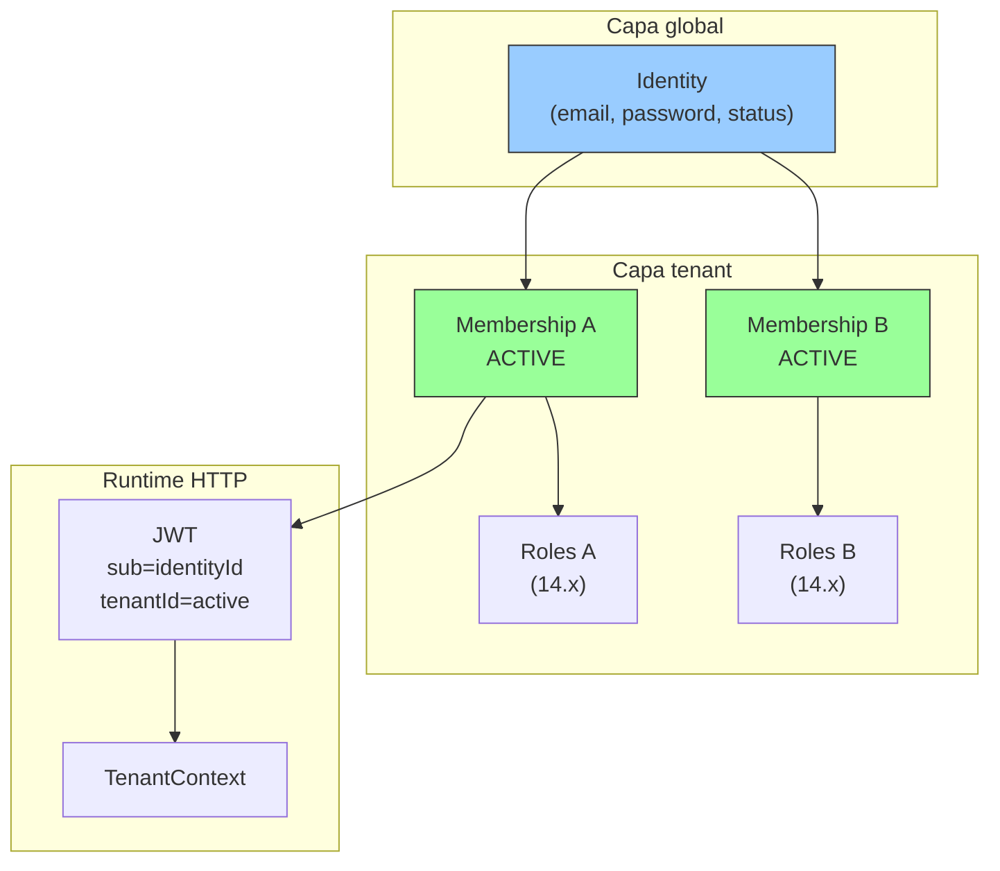

# PASO 13.0.1 — Identity Strategy Decision

**Fecha:** 2026-05-27  
**Alcance:** Decisión arquitectónica formal sobre el modelo de identidad definitivo de CodeCore.  
**Restricción:** Sin cambios de código, SQL, Flyway ni implementación.

**Estado previo verificado:** PASO 12.1–12.9 y PASO 13.0 (Tenant-Aware Operations Audit).

---

## 1. Resumen ejecutivo

### Decisión

CodeCore adopta como modelo definitivo:

## **Opción B — Identity Global + Membership**

Una **identidad global** (credenciales, email, estado de autenticación) vinculada a uno o más tenants mediante **Membership** (`identity_tenant_membership`), con autorización tenant-scoped (RBAC) anclada a la membership activa, no al aggregate `Identity`.

### Estado actual vs. objetivo

| Dimensión | Hoy (híbrido) | Objetivo (B) |
|-----------|---------------|--------------|
| Unicidad de email | `UNIQUE (tenant_id, normalized_email)` en `iam_user` | `UNIQUE (normalized_email)` global en `iam_user` |
| Pertenencia a tenant | `iam_user.tenant_id` + membership (doble fuente) | **Solo** `identity_tenant_membership` |
| Login | `X-Tenant-Id` + `findByTenantAndEmail` | Email + password → selección/validación de tenant vía membership |
| Mismo email, distintos tenants | Dos filas `iam_user`, dos `identity_id` | Una fila `iam_user`, N memberships |
| JWT | `identityId` + `tenantId` del comando | `identityId` (sub) + `tenantId` de membership ACTIVE validada |

La migración V7 ya documenta la intención original: *«N:M link between **global Identity** and Tenant»*. La implementación operativa divergió porque `iam_user.tenant_id` sigue siendo load-bearing (PASO 13.0).

---

## 2. Hallazgo que motiva la decisión

PASO 13.0 confirmó un **modelo híbrido de tres capas**:

1. **Legacy:** `iam_user.tenant_id` — lookup, unicidad, persistencia.
2. **Membership:** `identity_tenant_membership` — gate de pertenencia en login/registro.
3. **Runtime:** JWT `tenantId` → `TenantContext` — contexto de request autenticada.

Esto genera:

- Doble fuente de verdad (drift identity ↔ membership documentado en PASO 12.4).
- N:M formal en tabla pero **1:1 tenant-email** en práctica (test `shouldAllowSameEmailInDifferentTenants`).
- Deuda en ~120 archivos antes de poder deprecar `iam_user.tenant_id`.
- Bloqueo de capacidades SaaS: invitaciones, tenant switching, login único, RBAC por membership.

**Opción A** perpetúa esta deuda y contradice el diseño declarativo de V7 y el Context Map (IAM ≠ User Management ≠ Authorization).

---

## 3. Evaluación comparativa

### 3.1 Dominio (DDD)

| Criterio | Opción A — Tenant Scoped | Opción B — Global + Membership |
|----------|--------------------------|--------------------------------|
| Aggregate boundaries | `Identity` mezcla autenticación y pertenencia organizacional | `Identity` = credenciales globales; `IdentityTenantMembership` = pertenencia |
| Consistencia | Un aggregate por tenant+email; duplicación semántica | Un aggregate por persona; memberships como entidad de asociación |
| Complejidad | Baja hoy, alta a largo plazo (invitaciones, merge, RBAC) | Mayor refactor inicial; modelo estable para 14.x+ |
| Alineación CONTEXT-MAP | IAM absorbe concerns de User Management | IAM autentica; membership pertenece; Authorization asigna roles |

**Veredicto dominio:** **B** — separación clara de aggregates y lenguaje ubicuo alineado con `DOMAIN-GLOSSARY` y `MODULE-CATALOG`.

---

### 3.2 SaaS

| Capacidad | Opción A | Opción B |
|-----------|----------|----------|
| Multi-tenant | Aislamiento fuerte por duplicación | Aislamiento por membership + TenantContext + RBAC |
| Organizaciones | Requiere identidades duplicadas o sync manual | Natural: 1 identity, N org memberships |
| Invitaciones | Invitar email existente = conflicto o segunda identidad | Invitar email → crear membership sobre identity existente |
| Billing por tenant | Facturar por tenant OK; usuario duplicado complica métricas | Seat billing por membership ACTIVE |
| Marketplace / partners | Cross-tenant users = múltiples logins | Un login, múltiples tenants |
| White-label | Login por tenant aceptable | Login central + selector de org; white-label por subdomain |

**Veredicto SaaS:** **B** — requisito para plataforma enterprise SaaS según ADR-003 y roadmap de Subscription/Billing.

---

### 3.3 Seguridad

| Aspecto | Opción A | Opción B |
|---------|----------|----------|
| Login | Tenant explícito antes de credenciales (`X-Tenant-Id`) | Credenciales primero; tenant validado vía membership |
| JWT | `tenantId` del comando (hoy) | `tenantId` de membership ACTIVE validada |
| Tenant Context | Válido post-login | **Sigue válido** — representa tenant operativo activo |
| Membership gate | Post-lookup legacy | **Fuente única** de pertenencia |
| RBAC | Roles ambiguos (¿por identity o tenant?) | Roles por membership (14.x) |
| Riesgo cross-tenant | Bajo si membership se valida (ya hoy) | Requiere disciplina: toda operación tenant-scoped valida membership o TenantContext |

**Mitigación B:** Preservar orden anti-enumeración (401 antes de revelar membership); re-validar membership en operaciones sensibles; ADR-003 isolation vía `tenantId` en JWT + queries acotadas.

**Veredicto seguridad:** **B** con controles explícitos — no debilita aislamiento si membership es gate obligatorio.

---

### 3.4 Escalabilidad

| Escenario | Opción A | Opción B |
|-----------|----------|----------|
| Miles de tenants | N filas `iam_user` por usuario multi-tenant | 1 fila + N memberships (menor duplicación) |
| Usuarios compartidos | Anti-patrón (identidades duplicadas) | Patrón nativo |
| Cross-tenant membership | Tabla N:M sin beneficio real | Modelo coherente |
| Índices | `(tenant_id, normalized_email)` eficiente para lookup actual | `(normalized_email)` global + join membership |

**Veredicto escalabilidad:** **B** — menor explosión de filas y modelo coherente para usuarios multi-org.

---

### 3.5 Experiencia de usuario

| Flujo | Opción A | Opción B |
|-------|----------|----------|
| Login único | No — usuario debe conocer/proveer tenant | Sí — email + password |
| Cambio de tenant | Re-login con otro `X-Tenant-Id` | Token exchange / switch membership sin re-auth |
| Invitaciones | Segunda cuenta o conflicto | Aceptar invitación → nueva membership |
| Recuperación de contraseña | Por tenant (múltiples resets posibles) | Un reset global por identity |

**Veredicto UX:** **B**.

---

### 3.6 Coste de migración (desde estado actual)

| Área | Esfuerzo estimado | Notas |
|------|-------------------|-------|
| Lookup auth (13.1) | Medio | Nuevo `findByEmail`; membership como gate |
| Auth refactor (13.2) | Medio | Flujo login; JWT desde membership |
| Consolidación (13.3) | **Alto** | Merge `identity_id` duplicados por email |
| Verificación SoT (13.4) | Bajo–Medio | Queries reconciliación PASO 13.0 |
| Deprecar columna (13.5) | Medio | Flyway + dominio + ~120 referencias |
| Tests IAM | Alto | Suite extensa (~15+ IT) |
| Specs / blueprints | Medio | `repositories.md`, `security-rules.md`, workflows |

**Coste total:** Significativo pero acotado al módulo IAM. **No implementar B ahora** incrementa el coste en cada paso 14.x (roles, permissions, invitations).

**Opción A — coste de migración:** Cero inmediato; coste compuesto alto en features futuras.

---

## 4. Impacto futuro por área

### 4.1 Authorization Foundation (13.x)

- Membership como prerrequisito de autorización.
- Operaciones autenticadas consumen `TenantContext` (ya implementado 12.9).
- Base para 14.x sin re-diseño.

### 4.2 Roles (14.x)

- **B:** Rol asignado a `MembershipId` (o `identityId + tenantId`).
- **A:** Rol ambiguo — ¿mismo rol en todos los tenants donde el usuario tiene identidad duplicada?

### 4.3 Permissions (14.x)

- Permisos evaluados en contexto `(identityId, tenantId, membership)`.
- JWT puede incluir snapshot de roles/permissions por membership activa.

### 4.4 RBAC (14.x)

- Modelo canónico: `Identity → Membership → Role → Permission`.
- Encaja exclusivamente con **B**.

### 4.5 Invitations (futuro)

- Flujo: invitar `email` a `tenantId` → si identity existe, crear membership PENDING; si no, crear identity + membership.
- **A** fuerza bifurcación o identidad duplicada.

### 4.6 Organizations (futuro)

- Organization ≈ Tenant (o sub-entidad); membership es el vínculo persona–org.
- **B** es el modelo estándar (Slack, Notion, GitHub orgs).

### 4.7 Billing por tenant (futuro)

- Seats = memberships ACTIVE por tenant.
- **B** permite conteo preciso sin deduplicar identidades.

### 4.8 Tenant switching (futuro)

- Endpoint `POST /auth/switch-tenant` → nuevo JWT con otro `tenantId` de membership válida.
- Requiere **B** + identity global.

---

## 5. Decisión formal

### ¿Cuál debe ser el modelo definitivo de CodeCore?

# **Opción B — Identity Global + Membership**

### Ventajas

- Alineación con V7, Context Map y visión SaaS de ADR-003.
- Elimina doble fuente de verdad (`iam_user.tenant_id` vs membership).
- Habilita login único, invitaciones, tenant switching, billing por seat.
- RBAC natural en 14.x (rol por membership).
- Menor duplicación de credenciales y estados de cuenta.
- Membership ya implementada (12.1–12.3) — la inversión previa se capitaliza.

### Desventajas

- Refactor significativo en IAM (~120 referencias a `tenant_id`).
- Migración de datos: consolidar identities duplicadas por email.
- Login multi-membership requiere UX de selección de tenant (nuevo).
- Cambio de semántica en tests y APIs (`X-Tenant-Id` en login evoluciona).

### Riesgos

| Riesgo | Severidad | Mitigación |
|--------|-----------|------------|
| Autenticación cross-tenant por bug en lookup | Alta | Membership obligatoria; tests de aislamiento; code review 13.1–13.2 |
| Pérdida de datos en consolidación 13.3 | Alta | Script con dry-run; backup; criterios de merge documentados |
| Regresión suite IAM | Media | Migración incremental por sub-paso; IT en cada fase |
| Enumeración de tenants por email | Media | 401 uniforme hasta validar password; no listar memberships antes |
| Tokens legacy sin claim | Baja | Ventana de rotación (ya planificada 12.8) |

### Deuda técnica a resolver

1. `Identity extends AggregateRoot(TenantId)` — incompatible con modelo global.
2. `IdentityRepository` API tenant-scoped — reescribir puerto.
3. `UNIQUE (tenant_id, normalized_email)` — reemplazar por unicidad global.
4. Comportamiento `shouldAllowSameEmailInDifferentTenants` — invertir a una identity, dos memberships.
5. Specs que documentan `findByTenantAndEmail` como operación canónica.

### Estrategia de transición

**Principio:** Strangler incremental — membership como gate **antes** de eliminar columna legacy.

```
Fase actual (13.0)     →  Híbrido (legacy + membership)
Fase 13.1–13.2         →  Lookup global; auth membership-first
Fase 13.3              →  Consolidar identities duplicadas
Fase 13.4              →  Verificar 0 drift
Fase 13.5              →  Deprecar iam_user.tenant_id
Fase 14.x              →  Roles/permissions sobre membership
```

**Compatibilidad:** Durante 13.1–13.4, `iam_user.tenant_id` permanece poblado (sync desde membership) para rollback seguro. Solo en 13.5 se elimina.

---

## 6. Respuestas a preguntas obligatorias

| # | Pregunta | Respuesta |
|---|----------|-----------|
| 1 | ¿Identity debe seguir heredando `TenantId` desde `AggregateRoot`? | **No.** `Identity` es aggregate global. Otros aggregates operativos tenant-scoped (`Session`, `FailedLoginAttempt`) pueden conservar `TenantId` sin que `Identity` lo herede. |
| 2 | ¿`TenantId` debe salir del aggregate `Identity`? | **Sí.** La pertenencia organizacional vive en `IdentityTenantMembership`. |
| 3 | ¿Membership debe convertirse en la única fuente de pertenencia? | **Sí.** Tras 13.5, `identity_tenant_membership` es la única fuente de pertenencia identity↔tenant. |
| 4 | ¿JWT debe representar Identity o Membership? | **Identity como sujeto** (`sub` = `identityId`). **Membership como contexto operativo** (`tenantId` = tenant de la membership ACTIVE seleccionada; futuro `membershipId` en 14.x). |
| 5 | ¿`TenantContext` sigue siendo válido? | **Sí.** Representa el tenant activo de la request autenticada, derivado del JWT. No sustituye membership en login; lo complementa post-auth. |
| 6 | ¿RBAC encaja mejor con Identity Global o Tenant Scoped? | **Identity Global + Membership.** Roles y permisos se asignan a membership, no a identity aislada. |

---

## 7. Roadmap de migración (Opción B)

### 13.1 — Identity Lookup Migration

**Objetivo:** Desacoplar resolución de identidad de `iam_user.tenant_id`.

| Entregable | Detalle |
|------------|---------|
| Puerto | `findByEmail(EmailAddress)` sin tenant |
| Login | Resolver identity por email global → validar password → validar membership `(identityId, tenantId)` |
| Registro | `existsByEmail` global; crear identity + membership en transacción |
| DB (futuro) | Preparar `UNIQUE (normalized_email)` — no en este paso de análisis |
| Specs | Actualizar `repositories.md`, `security-rules.md` |

**Criterios de aceptación:**

- [ ] Cero llamadas a `findByTenantAndEmail` / `existsByTenantAndEmail` en producción.
- [ ] IT de login y registro equivalentes pasan.

---

### 13.2 — Authentication Refactor

**Objetivo:** Login y JWT basados en membership como gate principal.

| Entregable | Detalle |
|------------|---------|
| Use case | Reordenar: email → identity → password → membership ACTIVE |
| JWT | `tenantId` emitido solo si membership ACTIVE validada |
| HTTP | Evaluar evolución de `X-Tenant-Id` (obligatorio si multi-membership; opcional si única) |
| Seguridad | Preservar 401 vs 403; anti-enumeración |

**Criterios de aceptación:**

- [ ] JWT `tenantId` = tenant de membership validada.
- [ ] Sin regresión en `AuthenticationControllerIT`.

---

### 13.3 — Identity Consolidation Strategy

**Objetivo:** Resolver `mismo email + múltiples identity_id` (artefacto del modelo A).

| Entregable | Detalle |
|------------|---------|
| Inventario | Query: emails con COUNT(identity_id) > 1 |
| Reglas de merge | Elegir identity canónica (más antigua, más memberships, credencial más reciente) |
| Migración datos | Reasignar memberships huérfanas; desactivar identities duplicadas |
| Credenciales | Una sola password hash canónica; notificar usuarios afectados si aplica |
| Rollback | Snapshot pre-consolidación |

**Criterios de aceptación:**

- [ ] Un `normalized_email` → un `identity_id` en prod.
- [ ] Cero memberships apuntando a identities deprecadas.
- [ ] Runbook de merge documentado y probado en staging.

---

### 13.4 — Tenant Source Of Truth Verification

**Objetivo:** Garantizar consistencia identity ↔ membership antes de deprecar columna.

| Entregable | Detalle |
|------------|---------|
| Queries reconciliación | Identity sin membership; membership huérfana; `iam_user.tenant_id` ≠ membership |
| FK opcionales | `membership.identity_id → iam_user.id`, `membership.tenant_id → iam.tenant` |
| CI / alertas | Check de drift en pipeline o runbook operativo |

**Criterios de aceptación:**

- [ ] Query A (identity ACTIVE sin membership canónica) = 0 en prod.
- [ ] Query B (membership huérfana) = 0 en prod.
- [ ] Query C (tenant mismatch) = 0 en prod.

---

### 13.5 — Deprecate `iam_user.tenant_id`

**Objetivo:** Eliminar columna y deuda legacy.

| Entregable | Detalle |
|------------|---------|
| Flyway | Drop `tenant_id`, drop `uq_iam_user_tenant_normalized_email`, add `UNIQUE (normalized_email)` |
| Dominio | `Identity` sin `TenantId`; refactor `AggregateRoot` o base `GlobalAggregateRoot` |
| Repositorios | API sin tenant en lookups de identity |
| DTOs | Revisar `RegisterIdentityRequest.tenantId` (pertenece a membership, no a identity) |
| Re-audit | PASO 13.x confirma eliminable |

**Criterios de aceptación:**

- [ ] Columna `iam_user.tenant_id` eliminada.
- [ ] Cero referencias en Java/SQL.
- [ ] `BUILD SUCCESSFUL` + suite IAM completa.

---

## 8. Diagrama objetivo



---

## 9. Por qué se descarta Opción A como definitiva

Opción A es el **estado accidental actual**, no el diseño objetivo:

- Contradice el comentario de V7 (*global Identity*).
- Impide invitaciones y tenant switching sin workarounds.
- Duplica credenciales y estados de cuenta por tenant.
- Bloquea RBAC limpio en 14.x.
- Mantiene doble fuente de verdad indefinidamente.

Opción A puede mantenerse **temporalmente** durante la transición 13.1–13.4 como compatibilidad de columna legacy, pero **no** es el modelo definitivo de CodeCore.

---

## 10. Criterios de aceptación de este paso

| Criterio | Estado |
|----------|--------|
| Decisión arquitectónica formal | ✅ Opción B |
| ADR generado | ✅ [ADR-006](../architecture/ADR-006-IDENTITY-STRATEGY.md) |
| Roadmap validado (13.1–13.5) | ✅ |
| Estrategia de transición | ✅ Strangler incremental |
| Modelo definitivo identificado | ✅ Identity Global + Membership |
| Sin cambios de código | ✅ |

---

## 11. Referencias

| Documento | Relación |
|-----------|----------|
| [PASO-13.0-TENANT-AWARE-OPERATIONS-AUDIT.md](PASO-13.0-TENANT-AWARE-OPERATIONS-AUDIT.md) | Inventario de deuda; roadmap base |
| [PASO-12.2-IDENTITY-TENANT-MEMBERSHIP.md](PASO-12.2-IDENTITY-TENANT-MEMBERSHIP.md) | Introducción membership |
| [PASO-12.4-MEMBERSHIP-BACKFILL-AUDIT.md](PASO-12.4-MEMBERSHIP-BACKFILL-AUDIT.md) | Casos de drift |
| [ADR-006](../architecture/ADR-006-IDENTITY-STRATEGY.md) | ADR formal |
| `codecore-specifications/architecture/adr/ADR-003` | Multi-tenant isolation |
| `V7__create_identity_tenant_membership_table.sql` | Intención original global Identity |
