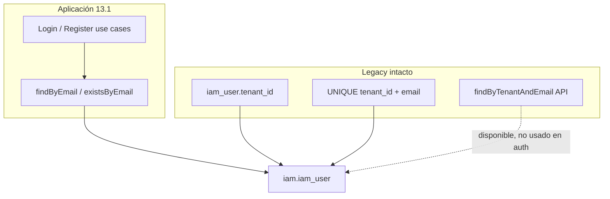

# PASO 13.1 — Identity Lookup Migration

**Fecha:** 2026-05-27  
**ADR:** [ADR-006](../architecture/ADR-006-IDENTITY-STRATEGY.md) — Identity Global + Membership  
**Auditoría previa:** [PASO-13.1-IDENTITY-LOOKUP-MIGRATION-AUDIT.md](PASO-13.1-IDENTITY-LOOKUP-MIGRATION-AUDIT.md)

---

## 1. Resumen ejecutivo

Se implementó la transición de lookup tenant-scoped a **lookup global por email** en login y registro, sin eliminar `iam_user.tenant_id`, sin consolidar identities, sin modificar JWT ni TenantContext.

| Flujo | Antes | Después |
|-------|-------|---------|
| Login | `findByTenantAndEmail(tenantId, email)` | `findByEmail(email)` → password → membership |
| Registro | `existsByTenantAndEmail(tenantId, email)` | `existsByEmail(email)` → 409 si email global existe |

---

## 2. Cambios realizados

### 2.1 `IdentityRepository` (puerto)

**Archivo:** `modules/identity-access-management/.../application/port/out/IdentityRepository.java`

Métodos **nuevos:**

```java
Mono<Identity> findByEmail(EmailAddress email);
Mono<Boolean> existsByEmail(EmailAddress email);
```

Métodos **mantenidos** (compatibilidad temporal):

```java
Mono<Identity> findByTenantAndEmail(TenantId tenantId, EmailAddress email);
Mono<Boolean> existsByTenantAndEmail(TenantId tenantId, EmailAddress email);
```

### 2.2 `SpringDataIamUserRepository`

**Archivo:** `.../infrastructure/persistence/repository/SpringDataIamUserRepository.java`

Métodos **nuevos:**

```java
Mono<IamUserEntity> findFirstByNormalizedEmailOrderByCreatedAtAsc(String normalizedEmail);
Mono<Boolean> existsByNormalizedEmail(String normalizedEmail);
```

Métodos tenant-scoped **sin cambios**.

### 2.3 `R2dbcIdentityRepository`

**Archivo:** `.../infrastructure/persistence/repository/R2dbcIdentityRepository.java`

| Método | Implementación |
|--------|----------------|
| `findByEmail` | `findFirstByNormalizedEmailOrderByCreatedAtAsc` → `IamUserMapper.toDomain` |
| `existsByEmail` | `existsByNormalizedEmail` |
| `findByTenantAndEmail` | Sin cambio |
| `existsByTenantAndEmail` | Sin cambio |

**Nota transitoria:** `findFirstByNormalizedEmailOrderByCreatedAtAsc` resuelve determinísticamente cuando existen filas legacy con mismo email en distintos tenants (hasta PASO 13.3).

### 2.4 `AuthenticateIdentityUseCaseImpl`

**Archivo:** `.../application/AuthenticateIdentityUseCaseImpl.java`

```text
Antes: findByTenantAndEmail(command.tenantId(), email)
Después: findByEmail(email)
```

Sin cambios en:

- Orden anti-enumeración (401 si identity ausente antes de password)
- Validación password
- `requireActiveMembership(identity, command.tenantId())`
- Emisión JWT (`AccessTokenClaims` con `tenantId` del comando)

### 2.5 `RegisterIdentityUseCaseImpl`

**Archivo:** `.../application/RegisterIdentityUseCaseImpl.java`

```text
Antes: existsByTenantAndEmail(command.tenantId(), email)
Después: existsByEmail(email)
```

Mensaje de error actualizado: `"Identity already exists for this email"`.

`Identity` sigue creándose con `tenantId` del comando (columna legacy intacta). Membership se crea en la misma transacción (12.7).

### 2.6 Sin modificar (por restricción)

| Componente | Estado |
|------------|--------|
| `iam_user.tenant_id` | Intacto |
| Flyway V2–V8 | Sin cambios |
| `MembershipRepository` | Sin cambios |
| `IdentityTenantMembership` | Sin cambios |
| `JwtTokenProvider` / `JwtTokenValidator` | Sin cambios |
| `TenantContext` / `ReactorTenantContext` | Sin cambios |

---

## 3. Consultas modificadas

| Operación | Query efectiva |
|-----------|----------------|
| Login lookup | `WHERE normalized_email = ? ORDER BY created_at ASC LIMIT 1` |
| Registro exists | `EXISTS (SELECT 1 FROM iam.iam_user WHERE normalized_email = ?)` |
| Legacy tenant lookup | `WHERE tenant_id = ? AND normalized_email = ?` (sin uso en use cases) |

---

## 4. Compatibilidad temporal



- **Registro:** rechaza email globalmente duplicado vía aplicación; DB aún permite duplicado cross-tenant si se inserta fuera del use case.
- **Login:** encuentra identity por email global; membership valida tenant del comando/`X-Tenant-Id`.
- **Consolidación:** pendiente PASO 13.3.

---

## 5. Tests

### 5.1 Actualizados

| Test | Cambio |
|------|--------|
| `AuthenticateIdentityUseCaseTest` | Mocks `findByEmail` en lugar de `findByTenantAndEmail` |
| `RegisterIdentityUseCaseTest` | Mocks `existsByEmail`; nuevo `shouldRejectDuplicateEmailInDifferentTenant` |
| `RegisterIdentityUseCaseIT` | `shouldRejectDuplicateEmailInDifferentTenant`; roundtrip usa `findByEmail` |
| `R2dbcIdentityRepositoryIT` | Nuevos `shouldFindAndExistByEmailGlobally`, `shouldReturnFalseWhenEmailDoesNotExistGlobally` |

### 5.2 Casos de aceptación cubiertos

| Caso | Test | Resultado |
|------|------|-----------|
| 1 — `findByEmail` retorna identity global | `R2dbcIdentityRepositoryIT.shouldFindAndExistByEmailGlobally` | ✅ (requiere Docker) |
| 2 — `existsByEmail` funciona | `R2dbcIdentityRepositoryIT` + unit tests | ✅ |
| 3 — Login: email → identity → membership | `AuthenticateIdentityUseCaseTest` (6 tests) | ✅ |
| 4 — Registro: email existente en otro tenant → 409 | `RegisterIdentityUseCaseTest/IT.shouldRejectDuplicateEmailInDifferentTenant` | ✅ |
| 5 — Sin regresión login | `AuthenticateIdentityUseCaseTest` + ITs existentes | ✅ unit; IT requiere Docker |

### 5.3 Resultados de build

```
./gradlew :modules:identity-access-management:test
```

| Categoría | Resultado |
|-----------|-----------|
| Tests unitarios | **50/50 PASSED** (incl. auth, register, JWT, TenantContext) |
| Tests integración (Testcontainers) | **49 FAILED** — Docker Desktop no disponible en entorno de ejecución |
| Compilación | **BUILD SUCCESSFUL** (`compileJava`, `compileTestJava`, `codecore-api:compileJava`) |

**Acción requerida:** Ejecutar suite IT completa con Docker Desktop activo para validar persistencia PostgreSQL.

---

## 6. Flujo objetivo alcanzado

```text
Login:
  email
    ↓
  findByEmail()
    ↓
  identity
    ↓
  password
    ↓
  membership(identityId, tenantId)
    ↓
  JWT (sin cambios en 13.1)

Registro:
  existsByEmail()
    ↓
  409 si email global existe
    ↓
  save identity + membership (transaccional)
```

---

## 7. Criterios de aceptación

| Criterio | Estado |
|----------|--------|
| Identity resoluble globalmente por email | ✅ |
| Login no usa `findByTenantAndEmail` en producción | ✅ |
| Registro no usa `existsByTenantAndEmail` en producción | ✅ |
| Membership valida tenant | ✅ (sin cambios) |
| `iam_user.tenant_id` no eliminado | ✅ |
| JWT / TenantContext sin cambios | ✅ |
| BUILD SUCCESSFUL (compilación + unit tests) | ✅ |
| IT PostgreSQL | ⚠️ Pendiente Docker |

---

## 8. Preparación para pasos siguientes

| Paso | Dependencia de 13.1 |
|------|----------------------|
| **13.2** Authentication Refactor | JWT `tenantId` derivado de membership validada |
| **13.3** Identity Consolidation | Merge `identity_id` duplicados por email |
| **13.4** Source of Truth Verification | Queries drift identity ↔ membership |
| **13.5** Deprecate `iam_user.tenant_id` | Drop columna + `UNIQUE (normalized_email)` |

---

## 9. Referencias

| Documento | Relación |
|-----------|----------|
| [PASO-13.0.1-IDENTITY-STRATEGY-DECISION.md](PASO-13.0.1-IDENTITY-STRATEGY-DECISION.md) | Decisión Opción B |
| [PASO-13.0-TENANT-AWARE-OPERATIONS-AUDIT.md](PASO-13.0-TENANT-AWARE-OPERATIONS-AUDIT.md) | Inventario deuda legacy |
| [ADR-006](../architecture/ADR-006-IDENTITY-STRATEGY.md) | ADR formal |
