# PASO 13.2 — Membership-Centric Authentication Audit

**Fecha:** 2026-05-27  
**Alcance:** Auditoría de compatibilidad del flujo de autenticación post-13.1 con ADR-006 (Identity Global + Membership).  
**Restricción:** Sin cambios de código, SQL, Flyway, JWT ni TenantContext.

**Estado previo verificado:** PASO 13.1 (lookup global), ADR-006, PASO 12.3–12.9.

---

## 1. Resumen ejecutivo

### Veredicto de compatibilidad

El flujo de autenticación post-13.1 es **compatible con ADR-006 solo cuando existe una única fila `iam_user` por email** (escenarios A y B). En presencia de **identities duplicadas legacy** (escenarios C, D, E), el sistema produce **logins imposibles** y **memberships inaccesibles**, pero **no autenticación cross-tenant exitosa** bajo el modelo de datos canónico (una membership ACTIVE por par identity+tenant).

### Decisión obligatoria

## ¿Es seguro avanzar a consolidación de identities?

# **SÍ**

**Justificación:** El estado actual con duplicados es **funcionalmente incorrecto** respecto a ADR-006; la consolidación (13.3–13.4) es la **remediación requerida**, no un riesgo opcional. Avanzar es seguro **con prerrequisitos**: inventario de duplicados, backup, dry-run en staging y ventana de migración controlada. **No** avanzar deja usuarios afectados en login imposible de forma indefinida y bloquea 13.6.

---

## 2. Flujo actual analizado

### 2.1 `AuthenticateIdentityUseCaseImpl` — secuencia exacta

```text
POST /api/v1/auth/login
  Header: X-Tenant-Id  →  command.tenantId()
  Body: email, password
    ↓
1. identityRepository.findByEmail(email)
     → findFirstByNormalizedEmailOrderByCreatedAtAsc
     → vacío: 401 InvalidCredentialsException
    ↓
2. identity.status() == ACTIVE
     → no: 403 IdentityNotAllowedToAuthenticateException (423 si LOCKED)
    ↓
3. passwordHasher.matches(rawPassword, credential)
     → no: 401 InvalidCredentialsException
    ↓
4. membershipRepository.findByIdentityId(identity.id())
     .filter(tenantId == command.tenantId())
     .filter(status == ACTIVE)
     → vacío/inactivo: 403 IdentityNotMemberOfTenantException
    ↓
5. tokenProvider.generateAccessToken(
       subject = identity.id(),
       tenantId = command.tenantId(),    ← del comando, NO de membership
       email, status)
```

**Observaciones críticas:**

| Punto | Comportamiento |
|-------|----------------|
| Resolución de identity | Global por email; **sin** considerar `tenantId` del comando |
| Resolución de membership | Acoplada a `identity.id()` devuelto en paso 1 |
| JWT `tenantId` | Emitido desde **comando HTTP**, no re-leído de membership |
| `iam_user.tenant_id` | **No participa** en login post-13.1 |
| Anti-enumeración | Parcial — 401 antes de password si email ausente; 403 tras password válido si membership ausente |

### 2.2 `IdentityRepository` — lookup global

```java
// R2dbcIdentityRepository.findByEmail
findFirstByNormalizedEmailOrderByCreatedAtAsc(normalizedEmail)
```

| Propiedad | Valor |
|-----------|-------|
| Criterio de desempate | `created_at ASC` (identity más antigua) |
| Tenant | Ignorado |
| Duplicados | Devuelve **una** fila; las demás son invisibles al login |

### 2.3 `MembershipRepository` — gate de pertenencia

| Método | Uso en login |
|--------|--------------|
| `findByIdentityId(identityId)` | Lista memberships; filtro en memoria por `tenantId` del comando |
| `findByTenantId` | **No usado** en autenticación |
| `exists(identityId, tenantId)` | **No usado** en autenticación |

No existe lookup `(tenantId, email)` → membership → identity.

### 2.4 `JwtTokenProvider`

- `subject` = `identity.id()` de la identity autenticada en paso 1.
- `tenantId` claim = `command.tenantId()` pasado a `AccessTokenClaims`.
- Coherencia JWT ↔ membership depende de que el paso 4 haya validado membership ACTIVE para ese par `(identity.id(), command.tenantId())`.

### 2.5 `TenantContext` / `ReactorTenantContext`

- Post-login: lee `tenantId` del JWT ya emitido.
- **No re-valida** membership en cada request.
- Fuera de alcance de esta auditoría de login; sin cambios en 13.2.

### 2.6 Tests de autenticación — cobertura y gaps

| Test | Cubre | Gap |
|------|-------|-----|
| `AuthenticateIdentityUseCaseTest` (6 unit) | Identity única + membership mock | **No** duplicados email |
| `AuthenticateIdentityUseCaseIT` (9 IT) | Flujo feliz PostgreSQL; membership missing/inactive | **No** escenario C/D |
| `AuthenticationControllerIT` (8 HTTP) | Semántica 401/403/423 | **No** duplicados legacy |
| `JwtTokenProviderTest` | Claims emitidos | N/A |
| `ReactorTenantContextTest` | JWT → contexto | N/A |

**Conclusión tests:** La suite valida el modelo **sin duplicados**. Ningún test documenta ni detecta regresión en escenarios C/D/E.

---

## 3. Escenarios construidos

### Escenario A — Identity única, Membership única

**Datos:**

```text
iam_user:
  id=100, email=juan@gmail.com, tenant_id=A, password=P1, created_at=T1

identity_tenant_membership:
  identity_id=100, tenant_id=A, ACTIVE
```

**Login:** `X-Tenant-Id: A`, `juan@gmail.com`, `P1`

| Paso | Resultado |
|------|-----------|
| findByEmail | Identity 100 |
| password | OK |
| membership(100, A) | ACTIVE |
| JWT | sub=100, tenantId=A |

**Resultado:** ✅ **Esperado y correcto** — modelo ADR-006 materializado.

---

### Escenario B — Identity única, Múltiples memberships

**Datos:**

```text
iam_user:
  id=100, email=juan@gmail.com, tenant_id=A, password=P1

memberships:
  (100, A, ACTIVE)
  (100, B, ACTIVE)
```

**Login tenant A:** ✅ OK — JWT sub=100, tenantId=A  
**Login tenant B:** ✅ OK — JWT sub=100, tenantId=B  
**Login tenant C:** password OK → membership(100, C) ausente → **403**

**Resultado:** ✅ **Esperado** — una identity global, tenant seleccionado por comando; membership gate funciona.

**Nota:** JWT `tenantId` viene del comando; membership valida que el par es legítimo. Coherente con ADR-006.

---

### Escenario C — Mismo email, Múltiples `identity_id` (legacy)

**Datos (modelo pre-13.1 / pre-consolidación):**

```text
iam_user:
  id=100, email=juan@gmail.com, tenant_id=A, password=P1, created_at=T1  (más antigua)
  id=200, email=juan@gmail.com, tenant_id=B, password=P2, created_at=T2

memberships:
  (100, A, ACTIVE)
  (200, B, ACTIVE)
```

`findByEmail` → **siempre Identity 100** (`ORDER BY created_at ASC`).

#### C.1 — Login tenant A, password P1

| Paso | Resultado |
|------|-----------|
| findByEmail | Identity 100 |
| password P1 | OK |
| membership(100, A) | ACTIVE |
| JWT | sub=**100**, tenantId=A |

✅ Login tenant A funciona.

#### C.2 — Login tenant B, password P2 (correcta para Identity 200)

| Paso | Resultado |
|------|-----------|
| findByEmail | Identity **100** (no 200) |
| password P2 vs hash de 100 | **FALLA** |
| HTTP | **401** Invalid credentials |

❌ **Login imposible** — credenciales correctas para el tenant B.

#### C.3 — Login tenant B, password P1 (password de Identity 100)

| Paso | Resultado |
|------|-----------|
| findByEmail | Identity 100 |
| password P1 | OK |
| membership(100, B) | **ausente** |
| HTTP | **403** Not member |

❌ **Login imposible** para tenant B.

#### C.4 — Mismo password P en ambas identities (usuario reutilizó contraseña)

| Paso | Resultado |
|------|-----------|
| findByEmail | Identity 100 |
| password | OK (mismo hash o misma contraseña) |
| membership(100, B) | ausente → **403** |

❌ Tenant B sigue inaccesible.

**Resultado escenario C:** ⚠️ **Incompatible con ADR-006** — Identity 200 y su membership en B son **inaccesibles vía login**. Solo funciona el tenant de la identity canónica (más antigua por `created_at`).

---

### Escenario D — `findByEmail` devuelve identity distinta a la que posee la membership del tenant solicitado

Este escenario es la **instancia concreta** del problema planteado en el brief.

**Datos:** Idénticos a escenario C.

```text
Solicitud: tenant=B, juan@gmail.com, password=P2

findByEmail     → Identity 100  (creada antes)
membership(B)   → pertenece a Identity 200
```

**Traza:**

```text
findByEmail → 100
password P2 → FAIL (hash de 200) → 401
```

Nunca se consulta membership de Identity 200.

**Si passwords fueran iguales:**

```text
findByEmail → 100
password → OK
membership(100, B) → vacío → 403
```

**Resultado:** ❌ Login imposible. Membership de Identity 200 en tenant B **permanece inaccesible**. No hay bypass cross-tenant exitoso, pero hay **denegación de servicio** al usuario legítimo.

**Riesgo de JWT equivocado:** Solo si Identity 100 tuviera membership ACTIVE en tenant B (dato inconsistente o consolidación parcial). Entonces JWT sub=100 para tenant B aunque la membership "esperada" del usuario fuera la de Identity 200.

---

### Escenario E — Datos parcialmente consolidados

**Estado:** Post-inicio 13.3; algunos emails unificados, otros no. Registro bloqueado por `existsByEmail` (13.1).

**Sub-escenarios:**

| Sub-caso | Datos | Login |
|----------|-------|-------|
| E.1 Email ya consolidado | 1 identity, N memberships migradas | ✅ A y B |
| E.2 Email no consolidado | 2 identities (C.3) | ❌ tenant no canónico |
| E.3 Membership migrada a canónica, identity duplicada sin borrar | membership(100,B) ACTIVE + fila 200 huérfana | ✅ tenant B vía 100 |
| E.4 Membership solo en identity no canónica | membership(200,B) sin migrar | ❌ tenant B inaccesible |
| E.5 Identity duplicada sin membership | fila 200 sin membership | Sin impacto login (invisible) |

**Resultado:** ⚠️ Comportamiento **mixto e impredecible** hasta completar 13.4. La ventana de consolidación parcial es el periodo de mayor riesgo operativo.

---

## 4. Matriz de resultados

| Escenario | Login correcto | Login imposible | Cross-tenant auth | Membership inaccesible |
|-----------|----------------|-----------------|-------------------|------------------------|
| A — 1 identity, 1 membership | ✅ | — | No | — |
| B — 1 identity, N memberships | ✅ | Solo tenants sin membership | No | — |
| C — N identities, mismo email | Solo tenant canónico | Tenants de identities no canónicas | **No** | Memberships de identities no canónicas |
| D — Desalineación findByEmail vs membership | Solo si coinciden en identity canónica | **Sí** — caso frecuente legacy | **No** (403 o 401) | **Sí** |
| E — Consolidación parcial | Parcial | Parcial | Bajo si membership mal migrada | **Sí** hasta completar migración |

---

## 5. Preguntas obligatorias

### 1. ¿Puede fallar login válido debido a identities duplicadas?

**Sí.**

- Usuario con credenciales válidas en Identity 200 (tenant B) recibe **401** (password no coincide con Identity 100) o **403** (password coincide pero membership de 100 no incluye B).
- Afecta cualquier tenant cuya membership esté anclada a una identity que **no** sea la devuelta por `findFirstByNormalizedEmailOrderByCreatedAtAsc`.

### 2. ¿Puede autenticarse en tenant incorrecto?

**No en el sentido de bypass de aislamiento**, bajo invariantes normales:

- JWT para tenant T solo se emite si existe membership ACTIVE `(identityResuelta, T)`.
- Atacante con credenciales de tenant A no obtiene JWT para tenant B salvo que Identity resuelta tenga membership ACTIVE en B.

**Matiz (riesgo de datos):** Si consolidación parcial deja membership de tenant B en identity canónica 100 por error de migración, el usuario accede a B con identity 100 — semánticamente correcto post-consolidación, incorrecto si la migración fue errónea.

### 3. ¿Puede emitirse JWT para una identity equivocada?

**Sí, en escenarios legacy/parciales:**

- JWT `sub` = identity devuelta por `findByEmail`, no necesariamente la que el usuario registró en ese tenant históricamente.
- Si solo existe una identity canónica post-consolidación, el problema desaparece.
- Hoy: JWT puede llevar `sub=100` cuando el usuario percibe su cuenta en tenant B como "Identity 200" (pre-consolidación).

### 4. ¿Qué memberships quedarían inaccesibles?

Todas las memberships cuyo `identity_id` **no** sea el devuelto por `findByEmail` para ese `normalized_email`:

```sql
-- Memberships potencialmente inaccesibles vía login
SELECT m.*
FROM iam.identity_tenant_membership m
JOIN iam.iam_user u ON u.id = m.identity_id
WHERE u.normalized_email IN (
    SELECT normalized_email
    FROM iam.iam_user
    GROUP BY normalized_email
    HAVING COUNT(DISTINCT id) > 1
)
AND m.identity_id <> (
    SELECT u2.id
    FROM iam.iam_user u2
    WHERE u2.normalized_email = u.normalized_email
    ORDER BY u2.created_at ASC
    LIMIT 1
);
```

En escenario C: membership `(200, B)` es inaccesible.

### 5. ¿Qué riesgos existen antes de 13.3?

| Riesgo | Severidad | Descripción |
|--------|-----------|-------------|
| Login imposible usuarios multi-tenant legacy | **Alta** | Usuarios reales bloqueados |
| Soporte / tickets por "contraseña correcta" | **Media** | 401/403 confusos |
| Fuga de información (403 vs 401) | **Baja–Media** | Password válido global pero sin membership → 403 revela credencial válida |
| Nuevos duplicados | **Baja** | `existsByEmail` en registro los bloquea desde 13.1 |
| Consolidación parcial (E) | **Alta** | Ventana de datos mixtos |
| Confianza en JWT sin re-check membership | **Baja hoy** | Riesgo futuro en operaciones sensibles (ya documentado 13.0) |

---

## 6. Compatibilidad con ADR-006

| Principio ADR-006 | Estado post-13.1 |
|-------------------|------------------|
| Una identity por email | **Aplicación sí** (registro); **DB no** (constraint legacy); **login no** si hay duplicados |
| Membership = pertenencia | **Sí** en login (gate paso 4) |
| Login global por email | **Parcial** — email global, pero identity mal resuelta con duplicados |
| JWT identity + tenant activo | **Sí** — sin cambios |
| TenantContext válido | **Sí** |

**Conclusión:** El flujo es **transicional**. Cumple ADR-006 en datos limpios. **No cumple** con duplicados legacy hasta 13.3–13.4.

---

## 7. Diseño futuro — flujo objetivo

### 7.1 Modelo objetivo ADR-006

```text
Identity (global, 1 por email)
    ↓
Membership (N por identity, 1 por tenant)
    ↓
Tenant (contexto operativo)
    ↓
JWT (sub=identityId, tenantId=membership.tenantId validada)
```

### 7.2 ¿Autenticación debe comenzar por Identity o por Membership?

**Respuesta: depende de si el tenant es conocido en el login.**

| Fase de login | Orden recomendado | Justificación |
|---------------|-------------------|---------------|
| **Tenant conocido** (`X-Tenant-Id` presente) — API actual | **Membership-centric primero** (o join tenant+email) | Evita seleccionar identity incorrecta en duplicados; alinea pertenencia antes de credenciales |
| **Tenant desconocido** (futuro login único) | **Identity primero** (email + password) → listar memberships → seleccionar tenant | UX tipo Slack/GitHub; requiere identity global ya consolidada |
| **Post-consolidación (13.4+)** con datos limpios | Identity primero es **aceptable** | `findByEmail` es unívoco; membership gate sigue obligatorio |

### 7.3 Flujo objetivo recomendado para 13.2+ (con `X-Tenant-Id`)

```text
1. Recibir (tenantId, email, password)
2. Resolver candidatos:
     Opción A (preferida): JOIN iam_user + membership
       WHERE normalized_email = ? AND membership.tenant_id = ? AND membership.status = ACTIVE
     Opción B: findByEmail + verificar membership (solo seguro sin duplicados)
3. Validar password sobre identity resuelta
4. Emitir JWT con tenantId = membership.tenantId validada (no solo del comando)
5. TenantContext consume JWT
```

**Cambio clave vs hoy:** El paso 2 debe **acoplar tenant + email** antes o durante la resolución de identity, no después con identity potencialmente errónea.

### 7.4 Diagrama objetivo post-consolidación

```mermaid
flowchart TB
    subgraph login [Login con X-Tenant-Id]
        REQ["tenantId + email + password"]
        RES["Resolver identity vía membership+email\n(o findByEmail unívoco)"]
        PWD["Validar password"]
        MEM["Confirmar membership ACTIVE"]
        JWT["JWT: sub + tenantId de membership"]
    end

    REQ --> RES
    RES --> PWD
    PWD --> MEM
    MEM --> JWT

    subgraph future [Login futuro sin tenant]
        REQ2["email + password"]
        ID2["findByEmail (unívoco)"]
        LIST["Listar memberships ACTIVE"]
        PICK["Usuario elige tenant"]
        JWT2["JWT con tenant elegido"]
    end

    REQ2 --> ID2
    ID2 --> LIST
    LIST --> PICK
    PICK --> JWT2
```



---

## 8. Roadmap refinado

### 13.3 — Identity Consolidation Strategy

**Objetivo:** Plan formal antes de tocar datos.

| Entregable | Detalle |
|------------|---------|
| Query inventario | Emails con `COUNT(DISTINCT id) > 1` |
| Reglas de canonicidad | Elegir identity ganadora: `created_at ASC` (alineado con findByEmail actual), o la que tiene más memberships ACTIVE, o credencial más reciente |
| Reglas de merge membership | Reasignar `membership.identity_id` → canónica; detectar conflictos `(canónica, tenant)` duplicados |
| Reglas de credencial | Una password hash canónica; política si difieren |
| Identidades perdedoras | Marcar INACTIVE / tabla de staging / soft-delete |
| Runbook rollback | Snapshot + script inverso |
| Comunicación | Usuarios afectados con login roto hoy |

**Criterios de aceptación:**

- [ ] Inventario ejecutado en staging y prod (solo lectura).
- [ ] Reglas de merge aprobadas por arquitectura.
- [ ] Cero ambigüedad en conflictos membership duplicados por tenant.

---

### 13.4 — Identity Consolidation Migration

**Objetivo:** Ejecutar consolidación en datos.

| Fase | Acción |
|------|--------|
| 1 | Backup `iam_user` + `identity_tenant_membership` |
| 2 | Por cada `normalized_email` duplicado: elegir canónica |
| 3 | `UPDATE membership SET identity_id = :canonical WHERE identity_id = :duplicate` |
| 4 | Desactivar o eliminar filas `iam_user` duplicadas |
| 5 | Verificar query de memberships inaccesibles = 0 |
| 6 | Smoke tests login por tenant afectado |

| Riesgo | Mitigación |
|--------|------------|
| Pérdida de memberships | Transacción por email; dry-run |
| UNIQUE violations en membership | Pre-check `(canonical, tenant)` |
| Downtime | Migración offline o por lotes de emails |

**Criterios de aceptación:**

- [ ] Un `normalized_email` → un `identity_id`.
- [ ] Toda membership ACTIVE apunta a identity canónica.
- [ ] Login manual tenant A y B verificado para emails previamente duplicados.

---

### 13.5 — Source Of Truth Verification

**Objetivo:** Cero drift antes de deprecar columna legacy.

| Query | Expectativa |
|-------|-------------|
| A — Identity sin membership canónica | 0 filas |
| B — Membership huérfana | 0 filas |
| C — `iam_user.tenant_id` ≠ membership principal | 0 filas (o documentado) |
| D — Email duplicado en `iam_user` | 0 filas |
| E — Membership inaccesible por findByEmail | 0 filas |

**CI / runbook:** Queries A–E en pipeline o checklist pre-deploy.

---

### 13.6 — Deprecate `iam_user.tenant_id`

**Objetivo:** Eliminar deuda legacy (antes 13.5 en roadmap 13.0.1).

| Cambio | Detalle |
|--------|--------|
| Flyway | Drop `tenant_id`; `UNIQUE (normalized_email)` |
| Dominio | `Identity` sin `TenantId` |
| `IdentityRepository` | Eliminar métodos tenant-scoped en lookups |
| Auth | JWT `tenantId` derivado de membership validada |
| Re-audit | Confirmar ADR-006 materializado |

**Prerrequisito:** 13.5 con 0 filas en todas las queries.

---

## 9. Recomendaciones inmediatas (sin implementar en 13.2)

| Prioridad | Acción |
|-----------|--------|
| P0 | Ejecutar inventario de duplicados en prod (solo lectura) |
| P0 | Iniciar 13.3–13.4 antes de nuevas features IAM |
| P1 | En 13.2 implementación futura: resolver auth por `(tenantId, email)` vía join membership |
| P1 | Añadir tests de regresión escenarios C y D |
| P2 | Emitir JWT `tenantId` desde membership validada, no solo del comando |
| P2 | Evaluar uniformar 403→401 post-password para anti-enumeración |

---

## 10. Criterios de aceptación de esta auditoría

| Criterio | Estado |
|----------|--------|
| Escenarios A–E documentados | ✅ |
| Riesgos identificados | ✅ |
| Flujo objetivo definido | ✅ |
| Roadmap 13.3–13.6 refinado | ✅ |
| Preguntas obligatorias respondidas | ✅ |
| Decisión SI/NO consolidación | ✅ **SÍ** |
| Sin cambios de código | ✅ |

---

## 11. Referencias

| Documento | Relación |
|-----------|----------|
| [ADR-006](../architecture/ADR-006-IDENTITY-STRATEGY.md) | Modelo objetivo |
| [PASO-13.1-IDENTITY-LOOKUP-MIGRATION.md](PASO-13.1-IDENTITY-LOOKUP-MIGRATION.md) | findByEmail implementado |
| [PASO-13.0-TENANT-AWARE-OPERATIONS-AUDIT.md](PASO-13.0-TENANT-AWARE-OPERATIONS-AUDIT.md) | Deuda legacy |
| [PASO-12.4-MEMBERSHIP-BACKFILL-AUDIT.md](PASO-12.4-MEMBERSHIP-BACKFILL-AUDIT.md) | Drift identity ↔ membership |
| `AuthenticateIdentityUseCaseImpl.java` | Flujo auditado |
| `R2dbcIdentityRepository.java` | `findFirstByNormalizedEmailOrderByCreatedAtAsc` |
